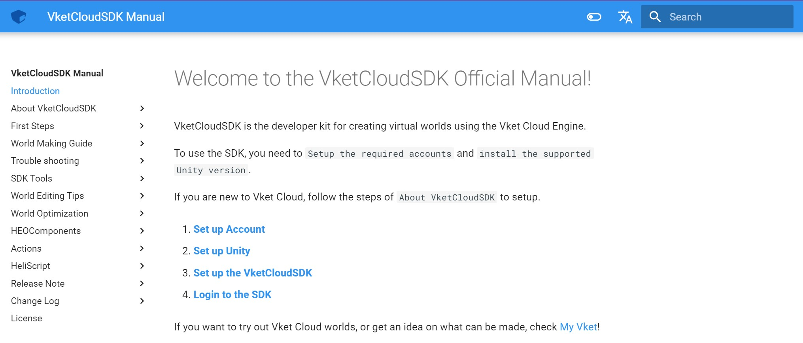

# VketCloudSDKマニュアルのレポジトリへようこそ！
このリポジトリは、VketCloudSDKのマニュアルを管理するリポジトリです。
最新のSDKマニュアルは以下のURLから確認できます。
https://vrhikky.github.io/VketCloudSDK_Documents/latest/index.html

## Contribution policy
社外のSDKユーザーからのコントリビューションの参加も絶賛受付中です。
誤字脱字の修正から文言のブラッシュアップまで、どんな些細なリクエストであっても、気軽にコミットいただいて結構です。
なお、プルリクエストされた時点で、以下の規約にご同意いただいたとみなします。ご了承ください。

- プルリクエストが承認されたとしても、いかなる報酬も発生しません。
- プルリクエストは却下される場合があり、かつ将来にわたって再度修正されることがあります。
- コミット内容に関して、著作権はHIKKYに帰属します。
- 悪質なコミットや嫌がらせに関しては、法的なしかるべき処置を持って対応します。

## Issue / Pull Requestについて

- Issueを立てる際はマニュアルのバージョンとURLを併記いただくようお願いいたします。

- Pull Requestについては編集対象のバージョンを指定してブランチを切り (例：version/sdk-9.5)、 Pull Requestを送る際もmasterではなくversionを指定してください。
公開されているマニュアルは基本的には週次で更新されますが、臨時的にSDKアップデートの際に更新される場合もあります。

## 執筆環境の導入
執筆環境の構築は、以下になります。

### ①リポジトリのクローン
お手持ちのPCにgit環境を導入し、リポジトリをクローンしてください。詳しい手順・ツールなどはお好みによって異なるため、ここでは割愛します。
git clone https://github.com/VRHIKKY/VketCloudSDK_Documents.git

### ②Pythonをインストールする

ローカル環境の構築にあたり、pythonが必要です。https://www.python.org/downloads/


既にインストールされている場合は、バージョン確認のため、以下コマンドを実行してください。

`python --version` もしくは `python3 --version`

バージョンは3.11を推奨しますが、上位バージョンでもおそらく問題ありません。
ただし、python2は確実に動作の保証ができません。お手持ちのPC（特にmac）がpython2しか入っていない場合は、お手数ですが最新のpythonを手動で導入してください。

### ③バッチファイルを実行する(Windowsの場合)
リポジトリとpythonの準備が完了したら、`VketCloudSDK_Documents > windows_mkdocs.bat`をExplorerで開き、ダブルクリックで実行します。

※ダブルクリック後、ブラウザが立ち上がります。ページ更新までに少しラグがあるので、しばしお待ちください。

※ダブルクリック後、実行権限を要求される場合は、管理者として実行してください、

※もしブラウザ遷移しない場合は、 http://127.0.0.1:8000/ を手動で開いてください。


### ③シェルスクリプトを実行する(Macの場合)
リポジトリとpythonの準備が完了したら、`VketCloudSDK_Documents > mac_mkdocs.sh`を実行します。
実行方法は、ターミナルを開き、以下のコマンドを実行してください。

```
cd {VketCloudSDK_Documentsのパス} #VketCloudSDK_Documentsのパスに移動
sh mac_mkdocs.sh #シェルスクリプトの実行
```

※動作しない場合は、シェルスクリプトの実行権限を付与してください。commandは以下の通りです。

```chmod +x mac_mkdocs.sh```

※もしブラウザ遷移しない場合は、 http://127.0.0.1:8000/ を手動で開いてください。

### ④編集した内容を反映する
ドキュメントトップが表示されたら、準備完了です。`VketCloudSDK_Documents > docs`以下に配置されている.mdファイルを編集して、内容を更新してください。


## お問い合わせ
執筆環境の導入や掲載内容についてのお問い合わせは、このリポジトリにissueを立てていただくか、VketCloudSDKのDiscordサーバー内にて、お問い合わせください。
