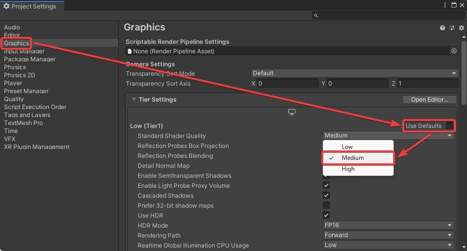
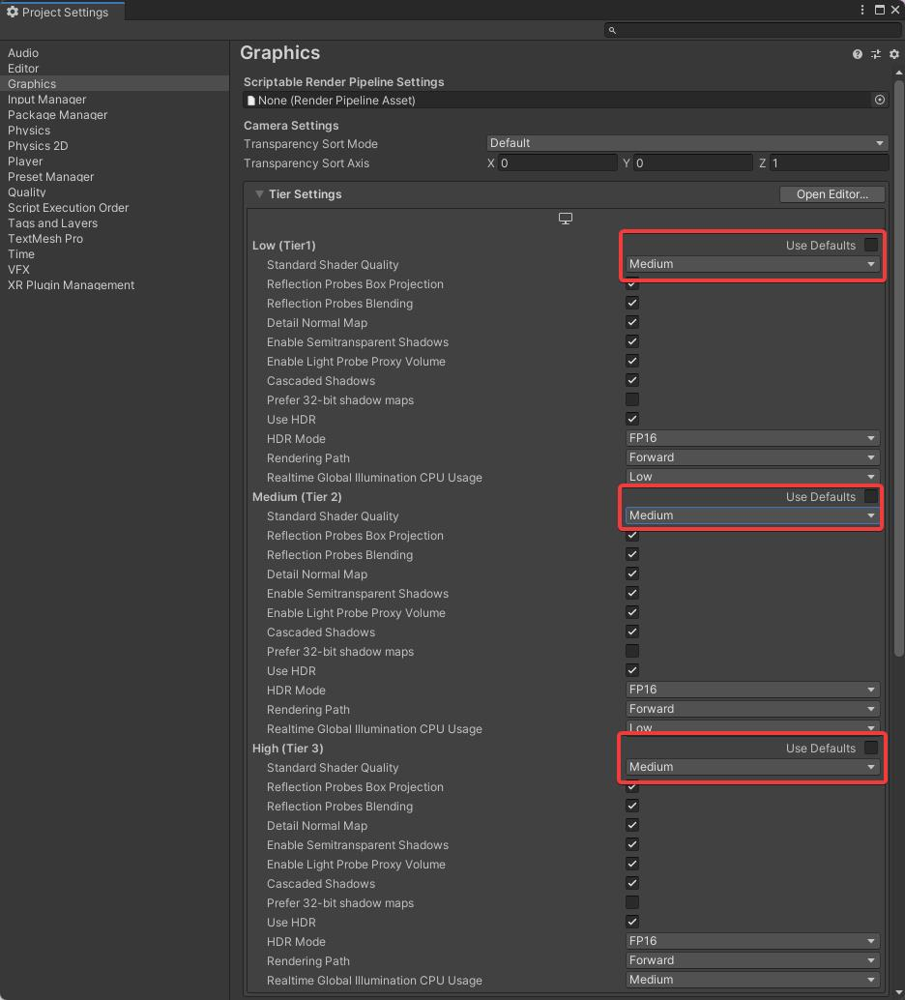

# Operating Environment

VketCloudSDK requires the following Unity editor version:

- **Unity 2019.4.31f1** (SDK13.7.7 and earlier)
- **Unity 2022.3.6f1** (SDK13.7.7 and later)

* SDK13.7.7 supports both versions.

If the above version of Unity is not installed, install by following the instructions below:

1. Download Unity Hub ([From here](https://unity3d.com/get-unity/download){target=_blank})  
  
2. Find and download the specified version from [Unity -Download Archive](https://unity3d.com/jp/get-unity/download/archive){target=_blank} (Click the “Unity Hub” option)

      

Please use one of the operating systems below when running Unity.

- Windows 10, 64-bit
- macOS 10.12+.

Also, we recommend the below systems when entering your world built with VketCloudSDK.

- PC: A computer that supports web browsers such as Chrome / Firefox / Safari / Edge.
- iOS: iPhone X or later, iPhone SE (2nd generation) or later
- Android: Android 11 or later / RAM: 8GB or more / For Google Pixel series, Pixel 5 or later

---

!!! note warning
    The below items will be automatically changed by the SDK, but sometimes the settings may be nullified. 
    In that case, please follow the below steps to manually change the settings,

    **Setting API compatibility level**

    1. Click Project Settings... from Edit in the Unity menu bar  

    2. When the Project Settings window appears, click Player from the list.  

    3. Check the Configuration in the Project Settings and change the Api Compatibility Level to ".NET 4.x" from the pull-down menu.

    

    **Setting LightMap Encoding**

    Likewise above, check the Configuration in the Project Settings and change the Lightmap Encoding to "Normal Quality" from the pull-down menu.

    

    **Setting Color Space**
    From Edit >Project Settings, set the  Color Space as Linear.

    

    On Ver12.3 and later versions, the settings below are required as well:

    **Setting Standard Shader Quality**

    The physically based rendering on Vket Cloud uses the same algorithm (GGX) as Unity's Medium level, so you will need to make some changes in the settings.

    1. In the Graphics settings screen, under "Tier Settings," uncheck "Use Defaults" for the "Low (Tier 1)" option, and change the "Standard Shader Quality" setting to "Medium."
      
      
    2. Repeat the process for "Medium (Tier 2)" and "High (Tier 3)" options located below "Low (Tier 1)."
      
