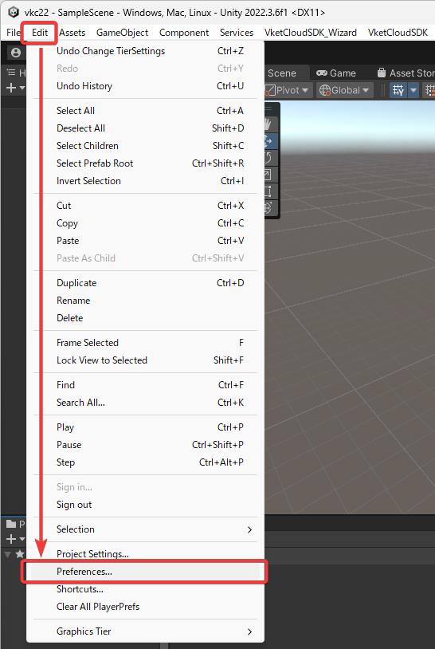

# Operating Environment

Vket Cloud SDK requires the following Unity editor version:

- **Unity 2019.4.31f1** (SDK13.7.7 and earlier)
- **Unity 2022.3.6f1** (SDK13.7.7 and later)

* SDK13.7.7 supports both versions.

If the above version of Unity is not installed, install by following the instructions below:

1. Download Unity Hub ([From here](https://unity3d.com/get-unity/download){target=_blank})  
  
2. Find and download the specified version from [Unity -Download Archive](https://unity3d.com/jp/get-unity/download/archive){target=_blank} (Click the “Unity Hub” option)

      

Please use one of the operating systems below when running Unity.

- Windows 10, 64-bit
- macOS 10.12+.

Also, we recommend the below systems when entering your world built with Vket Cloud SDK.

- PC: A computer that supports web browsers such as Chrome / Firefox / Safari / Edge.
- iOS: iPhone X or later, iPhone SE (2nd generation) or later
- Android: Android 11 or later / RAM: 8GB or more / For Google Pixel series, Pixel 5 or later
- IDE: When editing HeliScript, Visual Studio is not recommended due to the encoding issue. If you want to edit in an environment similar to Visual Studio, please use Visual Studio Code.

!!! warning "Note"
    When you open and save HeliScript created with Unity Vket Cloud SDK in Visual Studio, it may become ANSI, and you may not be able to build. 
    The following description explains how to change the editor that opens from Unity to Visual Studio Code.

!!! note "How to Change the Unity Editor to Visual Studio Code"
    Open the "Preferences" window from the Unity menu by selecting Edit > Preferences. 
     
    In the "External Tools" tab, select "Visual Studio Code" from the "External Script Editor" dropdown menu. 
    
