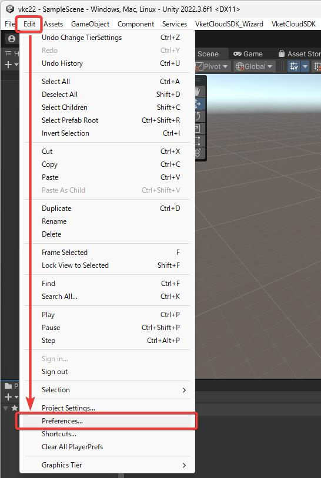
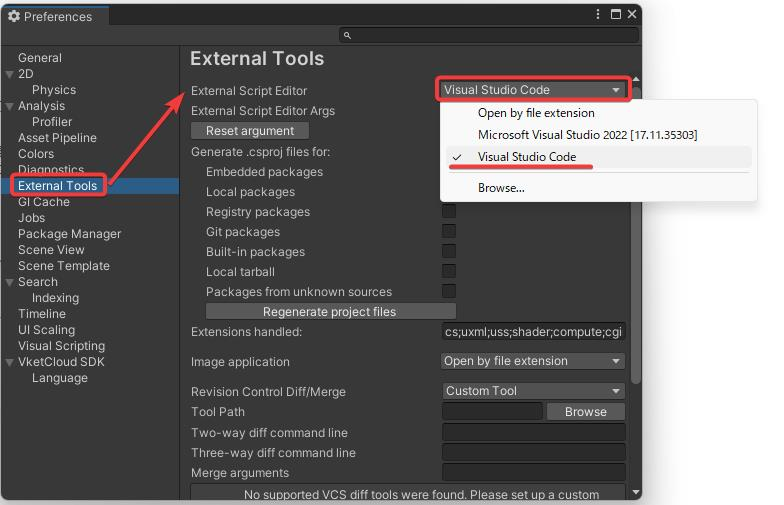

# VketCloudSDKの動作環境

VketCloudSDKは、以下のUnity環境が必要です。

- **Unity 2019.4.31f1** (SDK13.7.7以前)
- **Unity 2022.3.6f1** (SDK13.7.7以降)

* SDK13.7.7では両方のバージョンをサポートしています。

該当のUnityをお持ちでない方は[こちら](https://unity.com/releases/editor/archive){target=_blank}より対応バージョンをダウンロードしてください。

また、上記Unityバージョンを動作させるPC環境は以下を推奨します。

- Windows 10, 64-bit
- macOS 10.12+.

ならびに、VketCloudSDKでビルドしたワールドに入室する端末スペックは以下を推奨します。

- PC: Chrome / Firefox / Safari / Edge等のWebブラウザが使用できるもの。
- iOS: iPhone X以降、iPhone SE（第2世代）以降
- Android: Android 11.0以降、RAM 8GB以上（Google Pixelなら Pixel 5以降）
- IDE: HeliScriptを編集する際、下記の理由によりVisual Studioは非推奨です。Visual Studioと同様の環境で編集を行いたい場合はVisual Studio Codeをご使用ください。

!!! note warning
    Visual Studioを使用してUnityプロジェクト内にVketCloudSDKが作成したHeliScriptファイルを開き、編集を保存すると、エンコードがANSIに変換されてビルドが出来なくなってしまう場合があります。 
    以下にUntiyから開くエディターをVisual Studio Codeに変更する方法を記載しますので、参考にしてください。

!!! note "Unity指定エディターをVisual Studio Codeに変更する方法"
    Unityのメニュー上でEdit>Preferenceから「Preference」ウィンドウを開きます。 
      
    「External Tools」タブ内、「External Script Editor」から、「Visual Studio Code」を選択します。 
    
