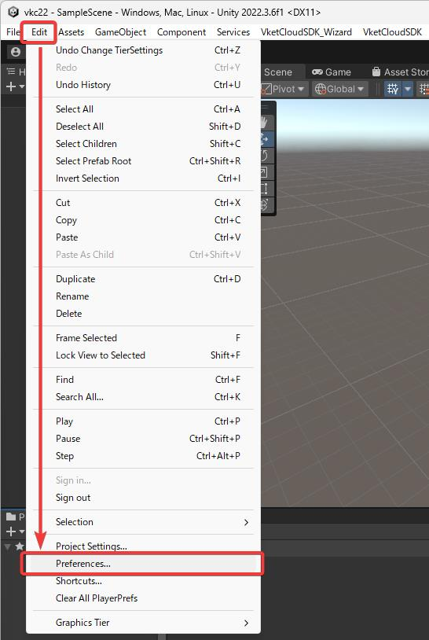
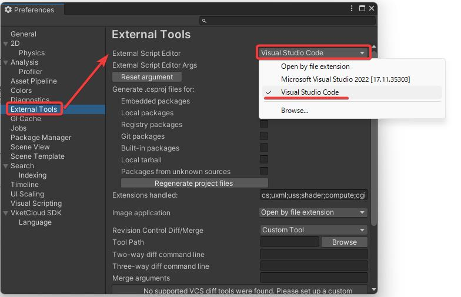

# Vket Cloud SDKの動作環境

Vket Cloud SDKは、以下のUnity環境が必要です。

- **Unity 2019.4.31f1** (SDK13.7.7以前)
- **Unity 2022.3.6f1** (SDK13.7.7以降)
- **Unity 2022.3.22f1** (SDK16.5.6以降)

* SDK13.7.7ではUnity 2019、2022両方のバージョンをサポートしています。

該当のUnityをお持ちでない方は[こちら](https://unity.com/releases/editor/archive){target=_blank}より対応バージョンをダウンロードしてください。

また、上記Unityバージョンを動作させるPC環境は以下を推奨します。

- Windows 11, 64-bit
- macOS 15.7+.

ならびに、Vket Cloud SDKでビルドしたワールドに入室する端末スペックは、[Vket Cloudワールドの遊び方](https://cloud.vket.com/howtoplay){target=_blank}の推奨環境をご確認ください。

- IDE: HeliScriptを編集する際、下記の理由によりVisual Studioは非推奨です。Visual Studioと同様の環境で編集を行いたい場合はVisual Studio Codeをご使用ください。

!!! warning "Note"
    Visual Studioを使用してUnityプロジェクト内にVket Cloud SDKが作成したHeliScriptファイルを開き、編集を保存すると、エンコードがANSIに変換されてビルドが出来なくなってしまう場合があります。 
    以下にUntiyから開くエディターをVisual Studio Codeに変更する方法を記載しますので、参考にしてください。

!!! note "Unity指定エディターをVisual Studio Codeに変更する方法"
    Unityのメニュー上でEdit>Preferenceから「Preference」ウィンドウを開きます。 
     
    「External Tools」タブ内、「External Script Editor」から、「Visual Studio Code」を選択します。 
    
