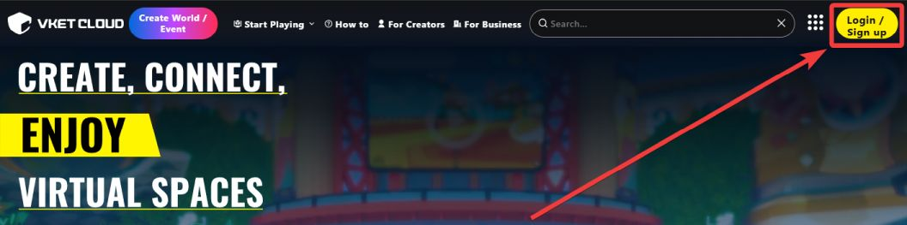
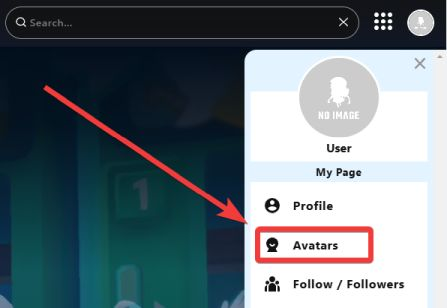
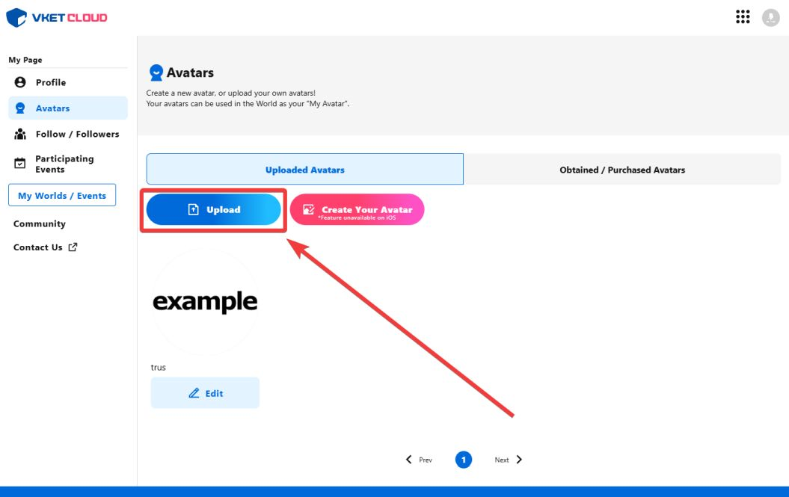
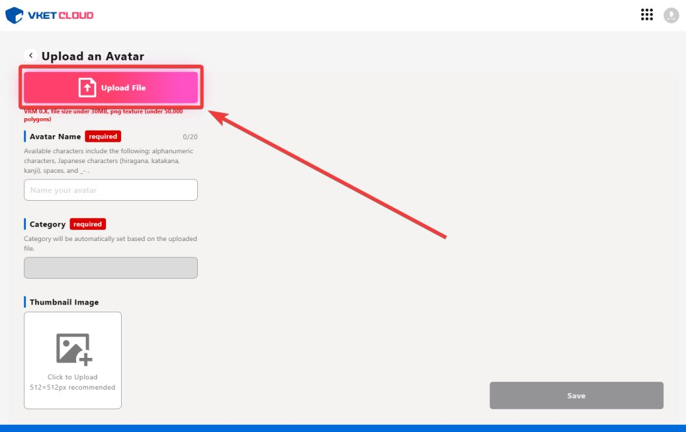
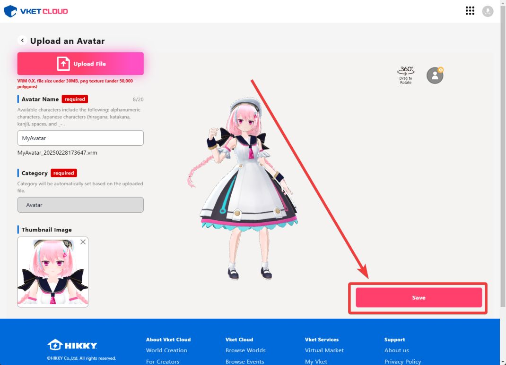
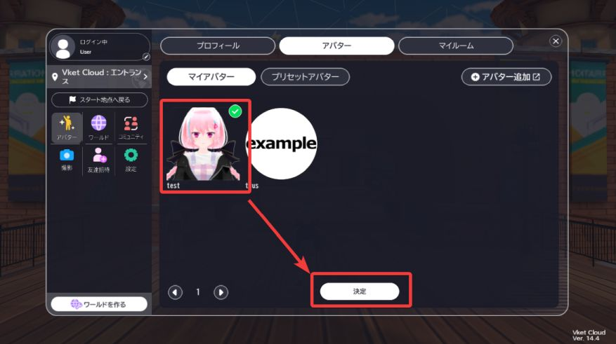
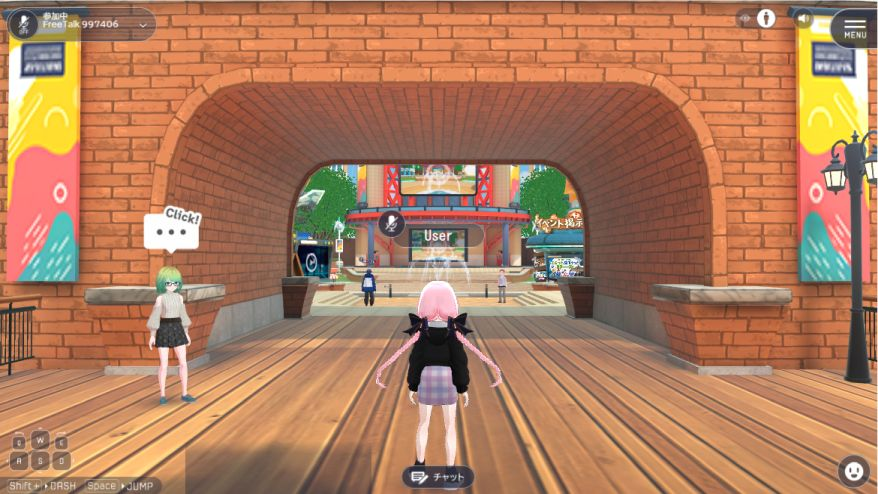

# How to use avatars

VketCloud provides two methods of using an avatar:**Using Vket Cloud Official Site** and **[Adding preset avatars to the world](../WorldMakingGuide/PresetAvatar.md)**. Here, we'll explain how to use the former.

1. Login to your account by accessing to [Vket Cloud Official Site](https://cloud.vket.com/){target=_blank}.

  
2. Open the menu on the top right, and select "Avatars".

3. Click "Upload" button.  

4. Click "Upload" to upload your VRM file.  

5. At the upload page, designate an item name (avatar name), category, thumbnail, etc.

6. Enter any world from [World list](https://cloud.vket.com/search/worlds){target=_blank} or the local build using your SDK.

7. After entering the room, the uploaded avatar will be displayed in the avatar menu accessed in "Settings"-->"MyPage"-->"Avatar".

8. Click the avatar icon, and your avatar will be changed!

!!! note tip
    You can also use the [Avatar Maker](https://avatarmaker.vket.com/edit/){target=_blank} to create your own avatar VRM.  
    If you find it difficult to create your avatar using modeling softwares or other tools, please consider using this service. 
    For details on adding preset avatars, refer to the [Adding Preset Avatars](../WorldMakingGuide/PresetAvatar.md) page.
