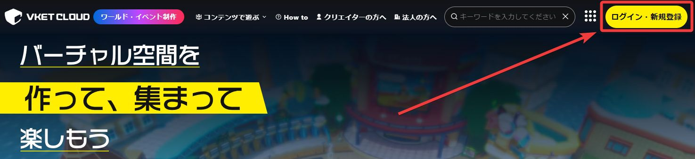
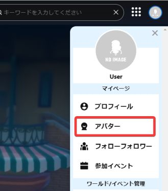
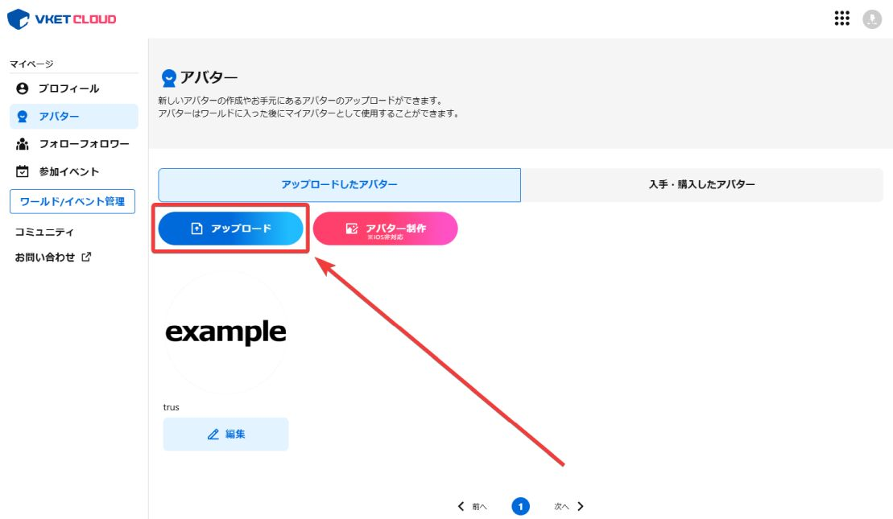
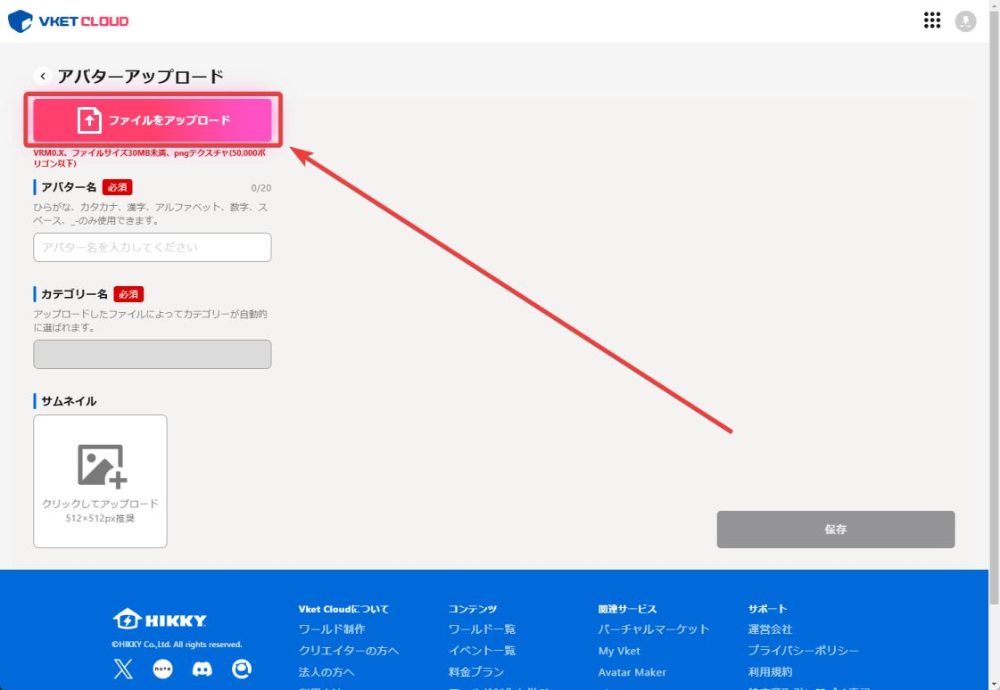
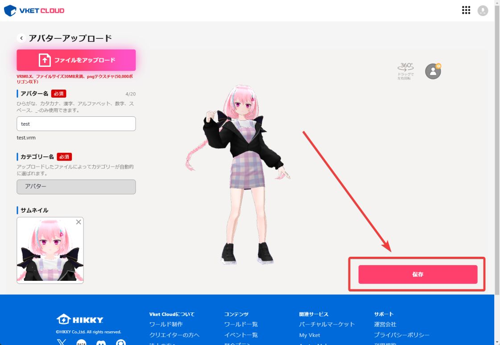

# アバターの使用方法

Vket Cloudでは、**①Vket Cloud公式サイトを使用する方法**と**②[ワールド内にプリセットアバターを追加する方法](../WorldMakingGuide/PresetAvatar.md)**の二つを提供しています。ここでは、Vket Cloud公式サイトを使用する方法について説明します。

1. Vket Cloud公式サイトのトップページ（[こちら](https://cloud.vket.com/){target=_blank}）よりログインします。

2. トップページ右上のメニューを展開し、「アバター」を選択します。

3. アバターの一覧とアップロードページへ移動するボタンが表示されるので、「アップロード」を押します。

4. 「アップロード」からVRMファイルをアップロードします。

5. アップロードページではアイテム名（アバター名）、サムネイル、カテゴリーなどを設定し、「保存」ボタンを押します。

6. ワールド一覧（[こちら](https://cloud.vket.com/search/worlds){target=_blank}）やSDKを使ったローカルビルドなどでワールドに入室します。

7. 入室後、設定メニューから「マイページ」を開き、「アバター」のメニューに先ほどアップロードしたアバターが表示されるので、選択して「決定」ボタンを押します。

8. ワールドにアバターが反映されます。

!!! tip "note"
    Avatar Maker（[こちら](https://avatarmaker.vket.com/edit/){target=_blank}）を使用して自作VRMを作成することもできます。モデリングソフト等で作成が難しい方は、ぜひこちらのサービスをご利用ください。 
    また、ワールド内にて選択できるプリセットアバターを追加したい場合は[プリセットアバターを追加する](../WorldMakingGuide/PresetAvatar.md)をご参照ください。
