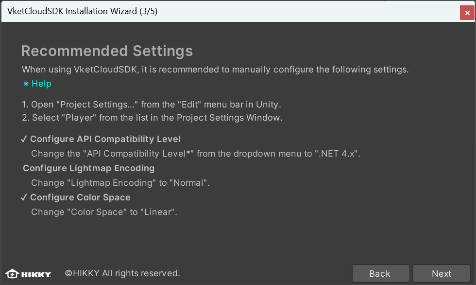

# How to install VketCloud SDK

To install VketCloud SDK, you need to use the Package Manager of Unity.
  
---
### Step 1. Open a project in Unity
Open a project of a supported version ([Unity Pre-prep](OperatingEnvironment.md){target=_blank}) or create a new project.
Select "3D" as the template, if you need one.

!!! note caution
If you put a space in the project name, the build may fail.
OK) MyProject NG) My Project

---
### Step 2. Register Registry information
Open the "Project Settings" window from the Unity menu Edit > Project Settings.
  
Select "Package Manager" from the left tab in the window and describe as follows.
  
| item | value |
| ---- | ---- |
| Name | VketCloudSDK Install Wizard |
| URL | https://registry.npmjs.com |
| Scope(s) | com.hikky.vketcloudsdk-install-wizard |  

   
  Finally, press the "Save" button to save the settings.
  
---
### Step 3. Install VketCloudSDK package from Package Manager
  
Open the "Packages" window from Unity's menu Window > Package Manager.

Select "My Registries" from the dropdown at the top of the window.

   

Select VketCloudSDK from the displayed list and press the “Install” button to start the installation. 
As on default the latest SDK version will be installed, follow the instructions below if you want to [install a specified version](#installing-a-specified-version--updating-an-existing-sdk).

Installation is complete if the item "VketCloudSDK" is added to the Unity menu.

## Step 4. インストールウィザードを使用してSDKをインストールする

新規にSDKをインストールする際はSDKインストールウィザードを使用します。

1\. Unityのメニューから SDK Installation Wizardを選択します。

    インストールウィザードを開くと、以下の画面が起動します。

2\. 「次へ」ボタンを押して、言語設定画面に移動します。言語設定画面でWizard内で使用する言語を設定できます。

3\. VketCloud SDKの初期設定をガイドする画面です。主に三つの設定を完了させてください。 初期設定しないことも可能ですが、その場合、SDKの動作保証はできません。

4\. 設定が完了されるとそれぞれの設定項目の左にチェックマークが表示されます。 設定されない状態で「次へ」ボタンを押すと以下警告画面が表示されます。

5\.「次へ」ボタンを押すと、バージョン選択画面が表示されます。 安定版、最新版、バージョンアーカイブからバージョンを選択できます。

!!! note caution
    バージョンアーカイブ内のバージョンは廃止が予定されております。 新規のワールド制作には使用しないようご注意ください。

6\. バージョンを選択し、インストールボタンを押すとパッケージのインポートが開始します。

7\.　およそ２～５分待つと、インストールが完了して以下の画面が表示されます。この画面からSDKマニュアルやコミュニティDiscordサーバーへとアクセスできます。

# 任意のバージョンの導入・既存バージョンSDKのアップデート

既にSDKを導入しているプロジェクトについては、SDK Version Managerを使用してバージョンの切り替え・アップデートが可能です。 
また、以前のSDKバージョンのようにPackage Managerあるいはmanifest.jsonの編集によるバージョン切り替えも引き続き利用可能です。

## SDK Version Managerによるバージョン切り替え

1\. VketCloudSDK_Wizard > SDK Version Managerを押して、バージョン選択画面が表示されます。

2\. バージョン選択画面でバージョンを選択し、インストールボタンを押してください。

!!! note caution
    バージョンアーカイブ内のバージョンは廃止が予定されております。 新規のワールド制作には使用しないようご注意ください。

3\. インストールボタンを押すと、インポート画面に移動します。

4\. インストールが完了すると、バージョン選択完了画面が表示されます。

この画面からSDKマニュアルやコミュニティDiscordサーバーへとアクセスできます。

!!! note caution
      既存のSDKのバージョンアップを行う際、アップデート後にComponentが欠落する現象が確認されています。 
      バージョンアップを行う際はプロジェクトの複製などによってバージョンアップ前の状態のバックアップを取ることを強くおすすめします。

### Version switching via Package Manager

After registering the registry information on [Step 2.](#step-2-register-registry-information), open the Package Manager via "Window" --> "Package Manager". 
In the Package Manager, make sure that the VketCloudSDK shows up on switching the registry view to "My Registries". 

On selecting "See all versions", all released SDK versions will be listed. 
Select the SDK version to be installed, then proceed by selecting the "Install" or "Update to [Version]" on the bottom right to install the SDK.

### Version switching via manifest.json

Editing the manifest.json is also available for switching versions. 
To open the project's manifest.json, right click on the Project window and select "Show in Explorer", which enables to locate the file in "Projects"-->[Project Name]-->"Packages".

By editing the version number on the right side of `"com.hikky.vketcloudsdk"`, the installing / updating version will be switched.

!!! note 
      If VketCloudSDK fails to show on the Unity menu, it may appear by rebooting the editor. 
      One of the reasons may be the lack of essential SDK packages, as the Deeplink package may fail to be imported automatically. 
      If such cases occur, please try a [manual package import](../troubleshooting/InstallingDeeplink.md). 
      
      As the EditorTutorialSystem may also rarely fail to be imported automatically, add the package below following the instructions on [Step 2.](#step-2-register-registry-information) on such occurence.

|  item  |  value  |
| ---- | ---- |
|  Name  |  EditorTutorialSystem  |
|  URL  |  https://registry.npmjs.org  |
|  Scope(s)  |  com.hikky.editortutorialsystem  |