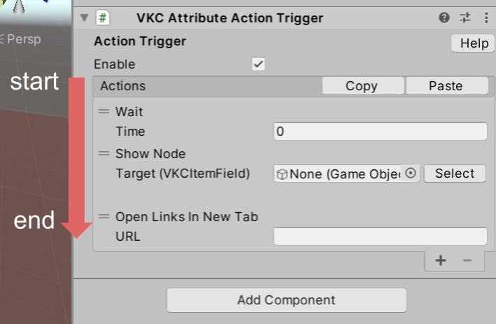

# About Actions

Actions are a part of your gimmick.
By using Actions, you can implement basic gimmicks like:

- Open browser pages
- Toggle On/Off objects and colliders
- Play animations and audios ...etc.

!!! Note Info
    Keep in mind these points when setting up your Actions:

    - Actions are executed in order from the top
    - Changes made by Actions are only applied locally (the world on your device)
    - Unity's Play function is not supported. To check if your Actions are working, use Build And Run