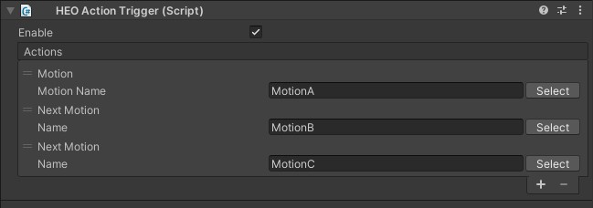

# NextMotion

NextMotionは、[Motion](./Motion.md)アクションで再生されたモーションの再生完了後に再生するモーションを設定できます。

Motion Nameには、モーション名を指定します。

| 名称 | 機能 |
| ---- | ---- |
| Motion Name | アバターファイルに設定されたモーション名を設定してください |

なお、この設定は一つのアクションリストで一回のみ使用することができ、複数指定することは出来ません。

具体的には、以下のように連続でNextMotionを置くことはできません。この仕様はHeliScriptにおける[SetNextMotion()](../../hs/hs_class_player.md#setnextmotion)も同様です。

NextMotionアクション発動時、プレイヤーが使用しているアバターに`Motion Name`で指定されたモーションがない場合、モーションは再生されません。

各アバターのモーション名とアニメーションはプリセットアバターの[Avatar File / Motion](../../WorldMakingGuide/AvatarFile.md#motion)もしくは[HEOWorldSetting / MyAvatar](../../HEOComponents/HEOWorldSetting.md#motion)から確認・変更できます。

