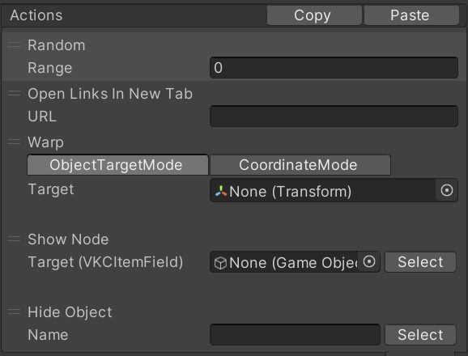

# Random

このアクションに続くアクションを指定範囲の中からランダムに実行します。

| 名称 | 機能  |
| ----   | ---- |
| Range | Randomノードからいくつ先までを抽選するかを指定します。 |

たとえば、`Range`が3で以下のようなノード順序になっていた場合、

ランダムノードによる抽選で実行される可能性があるノードは、`Open Links in New Tab` `Warp` `Show Node` です。`Hide Object`は四つ先のノードになるので、抽選の対象からは外れます。逆に、`Hide Object`は上記三つのノードのうちどれかが実行された後に必ず実行されます。 