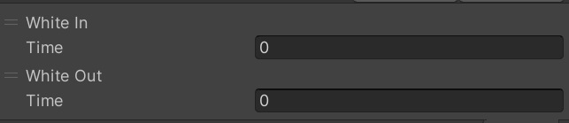

# WhiteOutIn

WhiteOut transitions the screen to white across a specified period of time.

WhiteIn returns the screen to normal across a specified period of time.

|  Label |  function  |
| ----   | ---- |
| time | Set the time taken for the transition. |