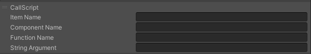

# CallScript


You can use "CallScript" to call methods from HeliScript or Script. When specifying arguments, you should separate the component name, method name, and arguments with commas.

For example, if you want to call the following method

```csharp
component Foo {

void Method(string Param)

}
```

If you specify "Foo,Method,abc" as the argument, the "Method" will be called with "abc" assigned to the parameter.

| Label |  Function  |
| ----   | ---- |
| Name | Specify ItemName |
| Text | Specify the Ccmponent name, method name, and arguments|
