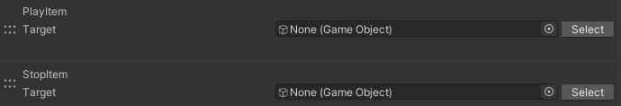
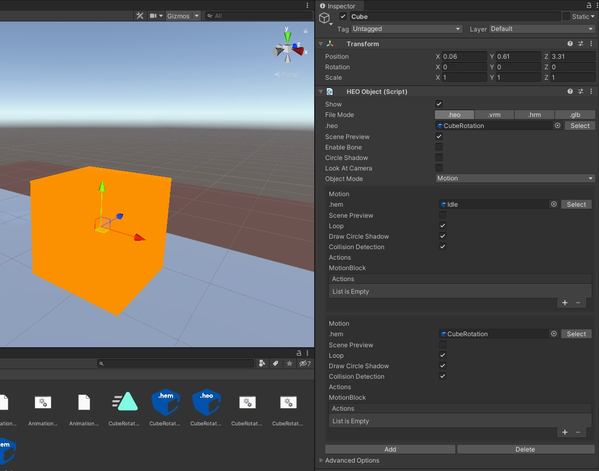
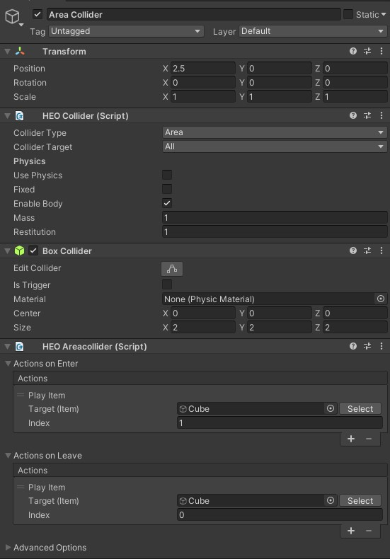

# Play/StopItem

## 概要

PlayItemは、オーディオ・パーティクル・**アバター以外の**オブジェクトアニメーションを再生します。

Targetに指定できるオブジェクトは、

- [VKC Item Audio](../../VKCComponents/VKCItemAudio.md)
- [VKC Item Particle](../../VKCComponents/VKCItemParticle.md)
- [VKC Item Object](../../VKCComponents/VKCItemObject.md)

を持つシーン上のオブジェクトです。

※アバターアニメーションの再生については[Motion](../Motion/Motion.md)をご参照ください。

[VKC Item Object](../../VKCComponents/VKCItemObject.md)を指定した場合のみ、Indexを追加で設定することができます。 
その場合、設定したIndex番号のモーションが再生されます。

また、TargetがBeginActionsを持つItemであれば、それも同時に実行します。

!!! info "オブジェクトアニメーションのより詳細な解説"
    オブジェクトのアニメーションについてより詳しい解説が知りたい場合は、[ワールド制作ガイド / オブジェクトをアニメーションさせる](../../WorldMakingGuide/PropAnimation.md)をご参照ください。

## StopItemについて

StopItemは、オーディオ・パーティクルを停止します。実行中のBeginActionsがあれば、それも停止します。

StopItemは一見、再生中のアニメーションを停止しそうなアクションですが、 StopItemの効果はBeginActionsの停止であり、**再生中の「オブジェクトアニメーション」**はBeginActionsに該当しないので止まりません。 
StopItemはパーティクルやサウンドを止めるのに使うことができます。

したがって、オブジェクトアニメーションを停止させたい際はLoopをオフにして自然停止させるか、もしくは以下の手順で停止用のMotionを用意してPlayItemにて呼び出す必要があります。

### 停止用のMotionを作る

1. ワールド制作ガイド「オブジェクトをアニメーションさせる」ページにおける[VKC Item Objectにアニメーションを付与する方法](../../WorldMakingGuide/PropAnimation.md#VKCItemObject)を参考に、以下のように[VKC Item Object](../../VKCComponents/VKCItemObject.md)を常にデフォルトの状態におくアニメーション(例としてIdleと命名)を用意・hemファイルに書き出しします。

    

2. [VKC Item Object](../../VKCComponents/VKCItemObject.md)では1番目にIdleをおき、2番目以降に再生したいアニメーションを配置します。1番目のMotionはワールド入場時の初期状態 / 待機時のMotionとなり、アニメーションを停止させたい際に呼び出すMotionを兼ねます。
    

3. ここでは停止制御の例として[VKC Item AreaCollider](../../VKCComponents/VKCItemAreaCollider.md)を使用します。 プレイヤーがエリアコライダーの範囲に入場した際にPlayItemを使用してCubeの2番目のMotion(Index **1**)を呼び出し、退場時にはPlayItemによって1番目のMotion(Index **0**)を呼び出します。

    

4. ワールドに入場すると以下のような挙動となります。

    
