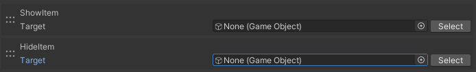

# Show/HideItem

ShowItemは、Itemとして管理されているオブジェクトを表示します。HideItemは、逆に非表示にします。
ここでいうItemとは、以下のコンポーネントで管理されるオブジェクトを指します。

- VKC Item Obejct
- VKC Item Plane
- VKC Item Textplane
- VKC Item Particle

.heo ファイルに含まれるオブジェクトの表示・非表示は[Show/HideNode](../Node/ShowHideNode.md)をご覧ください。