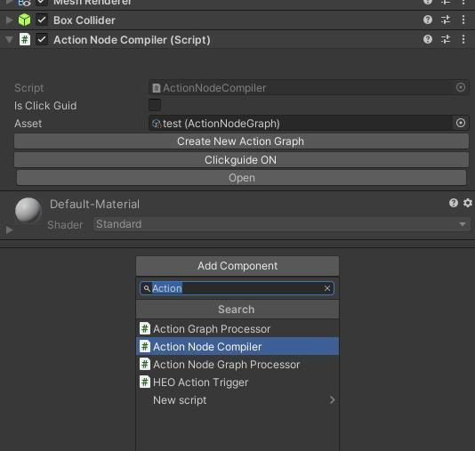
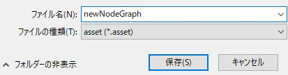
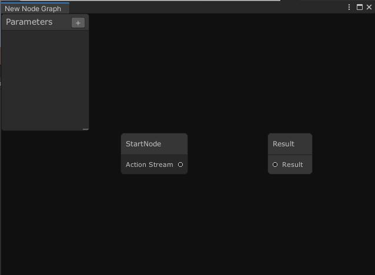
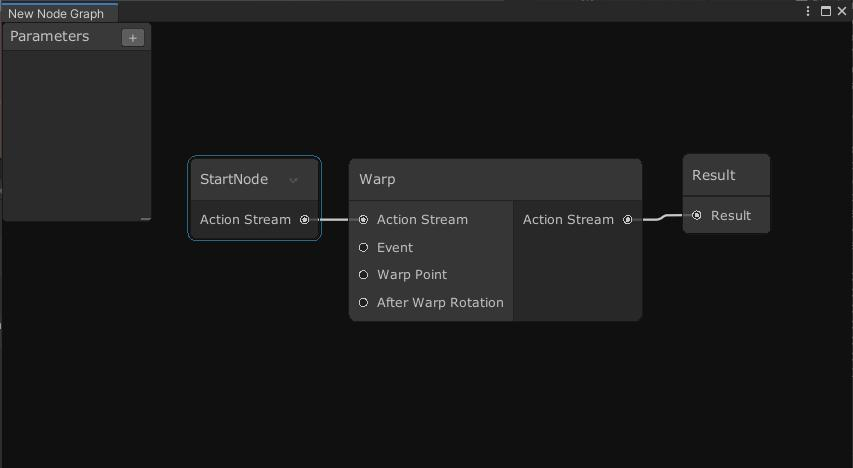
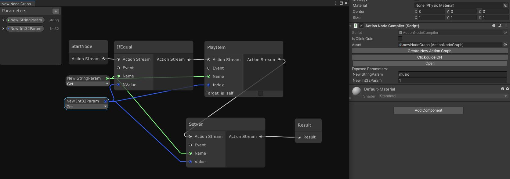

# ActionNodeGraph

This article will explain how to use ActionNodeGraph.  
*This function is in beta state. If you have any questions, please feel free to contact us.

## Overview

This component can be used as an alternative to [VKC Attribute Action Trigger](../../VKCComponents/VKCAttributeActionTrigger.md).  
It has the following advantages compared to VKC Attribute Action Trigger.  

- Actions can be managed visually with nodes
- Easy to change action execution order
- Easy portability of action lists to different objects

## How to use

① Attach the ActionNodeCompiler to the object you want to execute the action when clicked.  
 
 
② Select "Create New Action Graph" to create an ActionNodeGraph.  
You will see a save screen launched. Give it a name of your choice and save it.  
 
 
③Click Open to launch the node graph edit screen.  
Initially it should contain two nodes: StartNode and Result.  
 
 
④You can create a new ActionNodeGraph by right-clicking and selecting "Create Node".  
 
 
 
The action node should be found in Create Node > Actions.  
You can also search using the search box at the top.  
 
⑤ Connect Action Stream from Start Node to Result.  
 
Wire a node from the StartNode's Action Stream to the Action Node's Action Stream.  
Click ○ and drag and drop it to the destination node to connect.  
Any node between Start Node and Result is subject to the action that actually occurs.  
 
If you want to remove the connection,  
 
1. Click the connecting line 
2. Press the Delete key 

Use this when changing the connection destination.  
 
When deleting a node, select the node you want to delete and select Delete.  
 
⑥ You can create a parameter in the Parameters tab on the upper left.  
 
Click "+" button and select the type of parameter to create.  
 
 
When clicked, a node like the above will be generated.  
You can set the value of the parameter on the Inspector.  
If you check "Hide in Inspector", it will be hidden on the Inspector.  
 
 
Right click on the parameter to rename or delete the parameter.  
 
Parameters can be used by dragging and dropping them into the node space and connecting them to the corresponding ○.  
 
 
■ Example: Play the first animation of VKC Item Object name "music" (playback only once)■ 
 
 
"music" is created as a String type parameter and "1" an int type parameter.  
 
Connect "music" to Ifequal's Name and "1" to NValue.  
This completes the process of "if the content of music is 1, the subsequent processes does not occur".  
 
Connect "music" to the PlayItem's Name and "1" to the Index.  
This completes the process of "playing the animation registered at Index number "1" of VKC Item Object "music"".  
 
Connect SetVar's Name to "music" and Index to "1".  
This completes the process of "setting the contents of the parameter music to 1".  
 
For the first time, the processes after PlayItem will be run, but on and after the second time, SetVar sets the content of the variable music to 1, negating the processes after IfEqual.  
 
Since parameter nodes can be connected to multiple nodes, it is easier to manage them by connecting them to places where you want to have the same number.  
 
In the Primitives tab you can create parameters that can be edited in node space.  
 
 
It can be used in the same way as parameters created on Parameter.  
 
 
##Tips
 
①Target_is_self 
Some action nodes have a checkbox "Target_is_self".  
By checking this, the target of the operation can be the object itself to which the ActionNodeCompiler is attached.  
 
Example: Hide when clicked 
 
 
When preparing multiple objects that are hidden when clicked, if it is VKC Attribute Action Trigger, you will need to change the collider setting and the target to be hidden one by one. In this example's case, however, the NodeName will be automatically filled with the object with ActionNodeCompiler attached. Thus, you will only need to attach the ActionNodeCompiler with this ActionNodeGraph to the object you want to hide, without the need to change the colliders and hide target.  
 
②Switch ActionNodeGraph 
ActionNodeGraph can save action lists.  
 
ActionNodeGraph can be selected in Asset of ActionNodeCompiler.  
VKC Attribute Action Trigger makes it easy to change the action list.  