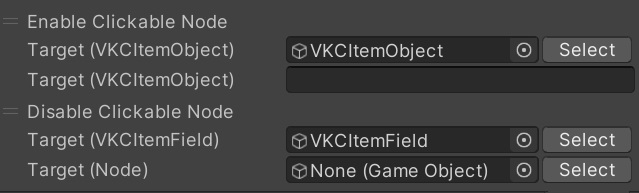

# Enable/Disable Clickable Node

This action enables you to switch between being able to click on the Objects below and not.

- [VKC Attribute Action Trigger](../../VKCComponents/VKCAttributeActionTrigger.md)
- [VKC Node Video Trigger](../../VKCComponents/VKCNodeVideoTrigger.md)
- HEOTweetTrigger (obsolete)
- HEOClickable (obsolete)

These components are categorized as "clickable", and can detect a click on your browser.

For the Target, specify an [VKC Item Field](../../VKCComponents/VKCItemField.md) or an [VKC Item Object](../../VKCComponents/VKCItemObject.md), which is the parent that hold the Objects you wish to control. As for Clickable In Target, specify the child objects that has the above components. If you set an [VKC Item Object](../../VKCComponents/VKCItemObject.md) in Target, you'll need to enter the Object's name in text.

The mesh itself will not go invisible. If you wish it to, check [Show/HideNode](./ShowHideNode.md), which is categorized as the same action class.
