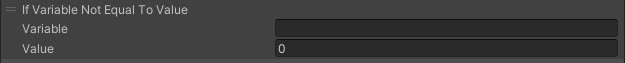

# If Variable Not Equal To Value

If Variable Not Equal To Value(日本語名：変数が値に等しくない場合)では、指定するVariable(変数)がValue(値)と等しくない場合、以降のアクションを実行せずに終了します。

変数は[Set Var](SetVar.md)にて定義したものが指定できます。

変数の加算は[Add Var](AddVar.md)で行う事が出来ます。

| 名称 | 機能  |
| ---- | ---- |
| Variable | 比較対象とする変数名を指定してください。 |
| Value | 比較する整数値を設定してください。 |
