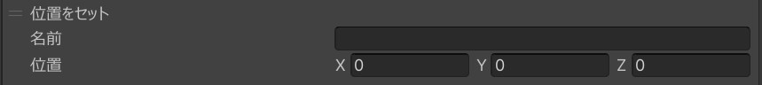

# 位置・回転をセット

##　位置をセット
物理演算上の位置を変更します。

|  ラベル |  機能  |
| ----   | ---- |
| 名前 | アクションを適応する物理オブジェクトの名前を指定してください。 |
| 位置 | ワールド座標系での位置を指定してください。 |

## 回転をセット
物理演算上の回転を変更します。

|  ラベル |  機能  |
| ----   | ---- |
| 名前 | アクションを適応する物理オブジェクトの名前を指定してください。 |
| 向き | ワールド座標系での回転を指定してください。 |

!!! Note Info
    物理エンジンが有効なオブジェクトに対してのみ有効です。
    物理エンジンの使い方については[PhysicsEngine](../../WorldMakingGuide/PhysicsEngine.md)を参照ください。