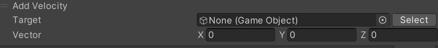

# Add Velocity

速度を加えます。

|  名称 |  機能  |
| ----   | ---- |
| Target | アクションを適応する物理オブジェクトの名前を指定してください。 |
| Vector | ワールド座標系でのベクトルを指定してください。 |

!!! info "Note"
    物理エンジンが有効なオブジェクトに対してのみ有効です。
    物理エンジンの使い方については[PhysicsEngine](../../WorldMakingGuide/PhysicsEngine.md)を参照ください。