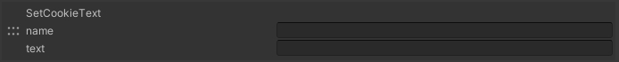

# SetCookieText

Saves the data name=text onto the Cookie. If either one is blank, nothing will be saved.

|  Label |  function  |
| ----   | ---- |
| name | Variable Name |
| text | The text you want to save. |
