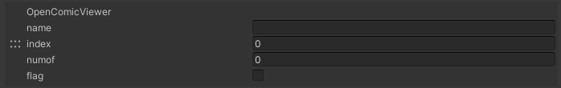

# OpenComicViewer


ワールド内の何らかのオブジェクトをクリックしたときに、コミックの見本誌やカタログなどを表示するための機能です。

|  ラベル |  機能  |
| ----   | ---- |
| name | dataフォルダからの相対パスで画像ファイル名を指定します。後述するindex、numof、拡張子を除いた部分までを記述します。ex. comic/convatlas_ |
| index | 固有の数字 |
| numof | 最大ページ数 |
| flag | falseに設定すると右開きになります。 |

## ファイル名のつけ方

```
convatlas_509_1.png
convatlas_509_2.png
convatlas_509_3.png
convatlas_509_4.png
convatlas_509_5.png
convatlas_509_6.png
```

上記のようなファイルを用意しておくことで、”index”の数字が後ろに追加された後、半角の「_」の後に各ページ番号を指定します。”numof”で最大ページ数を指定します。”flag”をfalseに設定すると右開きになります。

また、”numof”を1に指定すると、１枚だけ（上記の例だとconvatlas_509_1.jpgだけ用意しておく）画面中央に表示され、ページを進めるボタンが表示されなくなります。

なお、画面上に表示されているTweetボタンや閉じるボタンなどを変更したい場合は、各プロジェクトのCanvasファイルを編集して下さい。

## 画像について

画像は、２の累乗サイズの正方形で用意する必要があります。


なお、縦が1024pxの場合、横が724pxまでしか表示されません。右側の空いたスペースは、上記のように最右列のピクセルを引き延ばしたようにコピーしておくことをおすすめします。これはバイリニアやミップマップによって最右列の色が変化しないようにするための対処です。