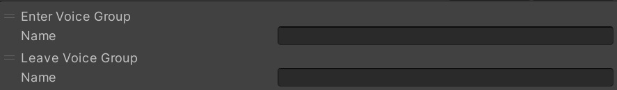

# Enter Leave Voice Group

Enter Voice Group adds a player to the specified voice group.

Leave Voice Group removes a player from the specified voice group.

Mainly intended to be called from an [VKC Item Area Collider](../../VKCComponents/VKCItemAreaCollider.md)'s Action.

|  Label |  Function  |
| ----   | ---- |
| Name | Specify the name of the voice group |
