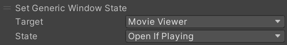

# Set Generic Window State

指定されたウィンドウのウィンドウ状態を設定します。

| 名称 | 機能 |
| ---- | ---- |
| Target | 状態を設定したいウィンドウ |
| State | ウィンドウを設定したい状態 |

ターゲットウィンドウは以下のいずれかの選択肢があります。

| 名称 | 機能 |
| ---- | ---- |
| Movie Viewer | 動画再生ウィンドウ |
| Screen Share | 画面共有ウィンドウ |
| Image Viewer | 画像表示ウィンドウ |

状態は以下のいずれかの選択肢があります。

| 名称 | 機能 |
| ---- | ---- |
| Open If Playing | 再生中の場合は開く。そうでない場合は閉じる。 |
| Open | 開く |
| Close | 閉じる |
| Maximize | 最大化 |
| Minimize | 最小化 |

Image Viewerの場合、画像を指定することで、画像を表示することができます。

| 名称 | 機能 |
| ---- | ---- |
| Image | 表示する画像 |