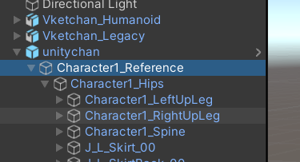
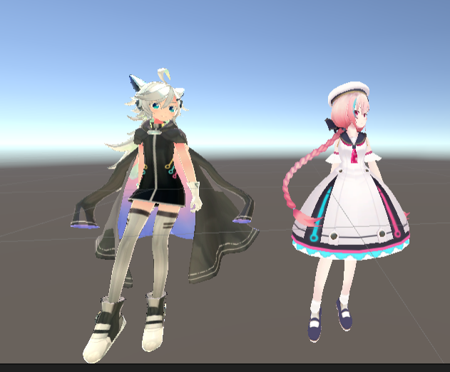

# Animation Converter 使い方
In VketCloud, the type of animation must be Legacy in Unity. Normally, the conversion from Humanoid to Legacy animation in Unity can only be done on the same character model due to differences in bone names and structure. Animation Converter can convert the Humanoid animation of character model A to a Legacy animation of character model B.

## 使用方法
### 1. Animation Converterの選択
Select "Animation Converter" from the "VketCloud SDK" tab on the Window toolbar.

### 2. 変数の設定
Variables must be set before animation conversion. The meaning of each variable is as follows:
・Conversion model... The character model that will be used for the legacy animation. At this point, it must be a Humanoid animation. After conversion, convert it to a legacy type Rig in Unity and check the converted animation.
・Animation to be converted...Humanoid animation to be converted to legacy animation
・Root...Root bone of the character model. For example, in Unity-chan, there is "Character1_Reference" directly under the character object, which is the root bone. This child is followed by "Hip," "Spine," etc. If there is a parent bone of the "Hip" bone directly under the character model, it must be set as the root.
・Save Folder...This is the folder where the converted animation will be saved. Click the "Select Save Folder" button to specify the destination folder.

※Currently, the OptionalBone "UpperChest" must be set in the Rig of the conversion model.

Translated with www.DeepL.com/Translator (free version)

### 3. アニメーションの変換
After all variables have been set, please press the Convert Animation button.
The conversion process will take place for a few seconds, and when finished, the converted animation will be in the designated folder.

### 4. 確認テスト
Let's play back the converted animation as a test. First, convert the character model you just used for the converted model to a legacy Rig and assign the converted legacy animation.
The following image shows the Humanoid animation of Vket-chan on the left, re-converted for legacy animation that Unity-chan can use, played back. If the conversion was done well, the same poses should play!

### 5. 制約
1. The Animation Converter is currently in beta. The following problems have been identified and will be resolved in due course.
Root animation cannot be converted
2. Finger animation cannot be converted
3. Cannot convert animations other than basic human body structures
4. Expression morphs cannot be converted
5. Other component animations (e.g., object OnOff) cannot be converted
6. Efficient iteration in conversion process for faster conversion speed