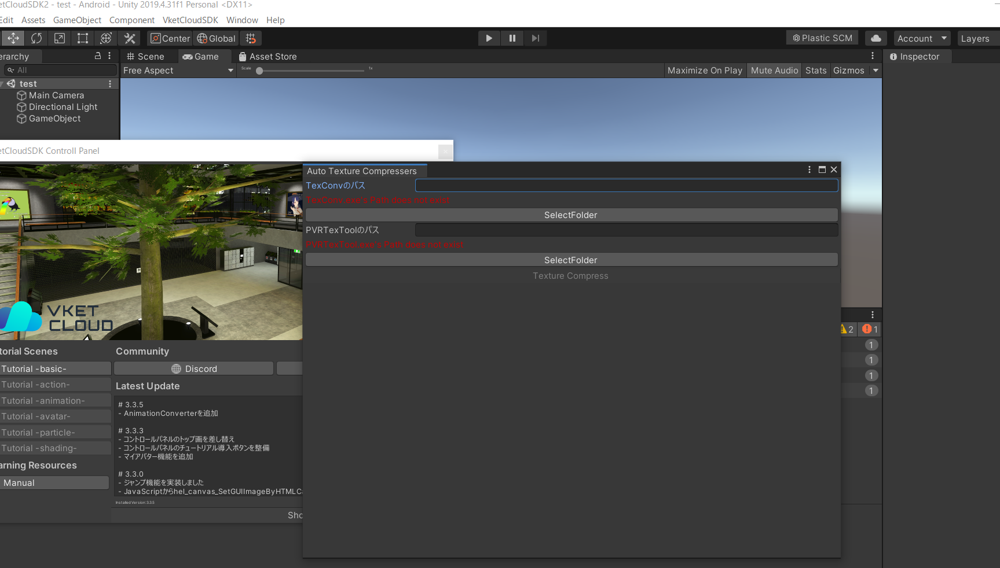
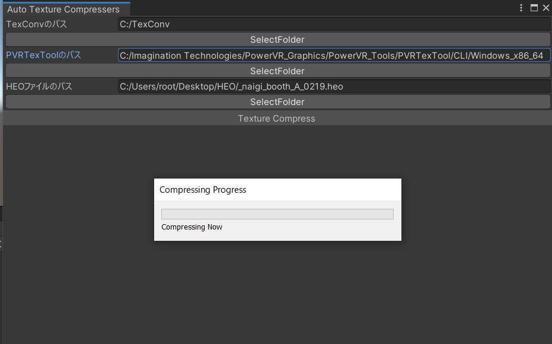

# AutoTextureConverter 使い方

## 使用方法
### 1. ツールのインストール
まず最初に、[PVRTexTool](https://developer.imaginationtech.com/pvrtextool/)と[TexConv](https://github.com/Microsoft/DirectXTex/wiki/Texconv)をインストールします。TexConvはページを開いてすぐ上の方にある「DOWNLOADS@LATEST」でファイルをインストールできます。

### 2. テクスチャ変換
ツールバー上の「VketCloudSDK」から、AutoTextureCompresserを選択してください。
下図のようなウィンドウが出てくるので、適切なフォルダパスを入力します。SelectFolderボタンによって各パスを直接指定することができます。指定後、TextureCompressというボタンを押してください。
	TexConv…TexConv.exeが配置されているフォルダを指定します。デフォルトでは「C://TexConv」を指定しています。
	PVRTexTool…PVRTexToolCLI.exeが配置されているフォルダを指定します。デフォルトでは「C:/ImaginationTechnologies/PowerVR_Graphics/PowerVR_Tools/
PVRTexTool/CLI/Windows_x86_64」を指定しています。
	HEOファイルのパス...作成したHEOファイルを指定します。※HEOファイルがあるディレクトリ内に「.astc」「.etc2」「.dxt」とついたバッチファイルが同梱されている必要があります。

### 3. 圧縮
指定後、TextureCompressというボタンを押してください。
圧縮中は下記画像が出て待機状態になります。現状のツールでは、外部ツール実行時のハンギング状態を解除されないので、フリーズしたような挙動を取りますが5分程度お待ちください。

### 4. HEOファイルの上書き
すべての圧縮が完了すると「texastc」「texdtx」「texetc2」というフォルダができ、HEOファイルも最新のものに上書きされた状態となりますのでご確認ください。