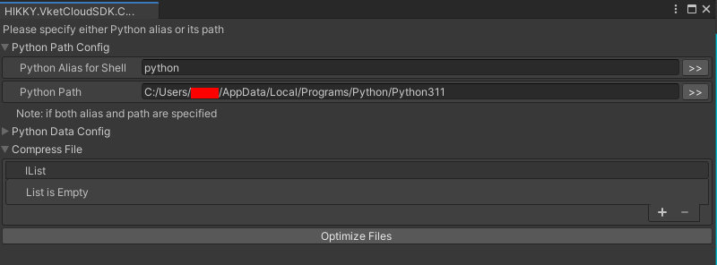
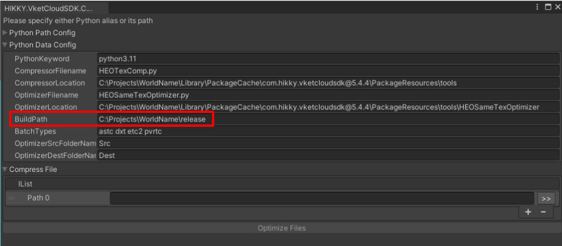

# How to Use the AutoTextureCompresser

## How to Use
### 1. Install Tools
At First, please install [PVRTexTool](https://developer.imaginationtech.com/pvrtextool/) and [TexConv](https://github.com/Microsoft/DirectXTex/wiki/ Texconv). TexConv can be found at the top of the page under "DOWNLOADS@LATEST" to install the files.

また、ツールを実行するためには最新(Ver. 3.11以降)の[Pythonのインストール](https://www.python.org/downloads/)が必要です。

### 2. 必要テクスチャの書き出し
テクスチャを圧縮するにあたって、メニューバーより`VketCloudSDK->BuildAndRun`を選択してreleaseフォルダ下に必要なテクスチャを書き出す必要があります。

### 3. テクスチャ変換
ツールバー上の「VketCloudSDK」から、AutoTextureCompresserを選択してください。 

下図のようなウィンドウが出てくるので、UIのパラメータに必要な項目を設定します。

圧縮を行うために必要な手順は以下の通りです。

1. **Python Alias for shell** にpythonのエイリアス名を設定します。
    エイリアスが設定されていない場合、Python Path(python.exeが置かれているファイル位置)の設定が必要です。

    

2. **PythonKeyword**にpythonのバージョンを指定します。

    

3. **CompressorLocation**にHEOTexComp.pyのフォルダまでのフルパスを指定します。 見つからない場合はAssetsにて"HEOTexComp"と検索をかけ、出現したフォルダをエキスプローラから開いてパスを取得します。
    

4. **OptimizerLocation**にHEOSameTexOptimizer.pyのフォルダまでのフルパスを指定します。

    

5. **BuildPath**にVketCloudSDKでビルドしたreleaseフォルダまでのパスを指定します。

    

!!! note caution
        Ver4.8 / Ver5.4では初期値にJRWorldという文字列が混じっているため、該当の文字列を削除した上でのツールの使用をお願いいたします。
        本不具合は次回のアップデートで修正される予定です。
    

6. IList内に**Path0**にField毎の**BuildPath以下の相対パス**を指定します。 具体的にはプロジェクトをエキスプローラにて開き、upload/data/Field下にある[HEOField](../HEOComponents/HEOField.md)がアタッチされたオブジェクトと同名のパスを指定します。 複数指定する必要がある場合は改行します。
例)
　data\Field\World
　data\Field\PartyRoom
　data\Field\*
    

7. **Optimize Files**ボタンをクリック

圧縮中は下記画像が出て待機状態になります。 
現状のツールでは、外部ツール実行時のハンギング状態を解除されないので、フリーズしたような挙動を取りますが5分程度お待ちください。

すべての圧縮が完了すると「プロジェクト名/release/data/field」以下にあるHEOファイルに「texastc」「texdtx」「texetc2」というフォルダができ、HEOファイルも最新のものに上書きされた状態となります。

## UIのパラメータ説明
以下の各パラメータに対して設定を行います。

#### Python Path Config

| 変数 | 初期値 | 機能 |
| ---- | ---- | ---- |
| Python Alias for Shell | なし | cmdにて使用されるpythonのエイリアス名です。 Pythonに対してエイリアスを設定していない場合は`Python Path`を必ず設定します。 |
| Python Path | なし |python.exeのディレクトリパスを設定します。 |

#### Python Data Config

| 変数 | 初期値 | 機能 |
| ---- | ---- | ---- |
| Python Keyword | python3.11 | 実行するpython.exeの名前。Python Aliasと一致する |
| Compressor Filename | HEOTexComp.py | HEOTexCompスクリプトのファイル名 |
| Compressor Location | C:\Project\ |HEOTexComp.pyのフォルダパスを指定します。  {PROJECT_PATH}\Packages\VketCloudSDK\PackageResources\tools\HEOTexComp |
| Optimizer Filename |HEOSameTexOptimizer.py |HEOSameTexOptimizerスクリプトのファイル名 |
| Optimizer Location |C:\Project\ | HEOSameTexOptimizer.pyのフォルダパスを指定します。  {PROJECT_PATH}\Packages\VketCloudSDK\PackageResources\tools\HEOSameTexOptimizer |
| BuildPath | C:\Project\release |VketCloudSDKでビルドしたreleaseフォルダまでのパス |
| Batch Type |astc dxt etc2 pvrtc | PVRTextToolやTexconvを使うバッチファイル名のリストです。|
| OptimizerSrcFolderName | Src |HEOSameTexOptimizerが求めるSourceフォルダの名前 |
| OptimizerDestFolderName |Dest |HEOSameTexOptimizerが出力用に使うフォルダ名 |

#### Compress File

| 変数 | 初期値 | 機能 |
| ---- | ---- | ---- |
|IList |　なし | 変換するHEOが含まれるフォルダーパスを列挙したtxtファイル |