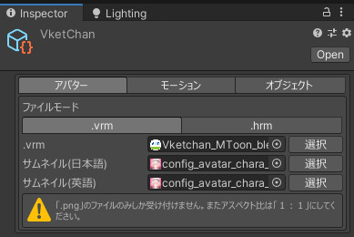
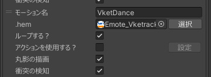
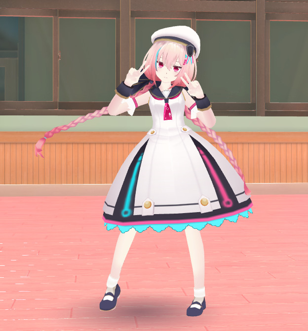
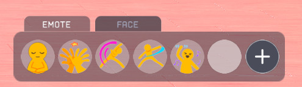
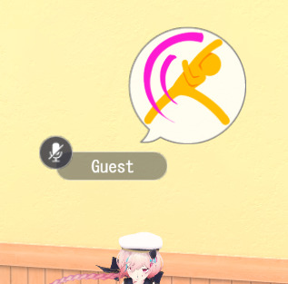

# Adding Motions After Lib13

## Overview

In Lib13, Canvas assets and emote animations are now retrieved from the server, meaning that these assets are no longer stored on the in-game side.
As a result, while automatic updates have become possible, implementing scene-specific UI or custom emotes has become more challenging than before.
This article introduces a method for implementing custom emotes in the Lib13 environment.

!!! info "Test Environment"
    SDK Version: 13.7.7 
    OS: Windows 10 
    Unity: 2019.4.31.f1 
    Browser: Chrome

## Prerequisite Knowledge

In VketCloudSDK13, the `AvatarFile` does not include an emote section.

Therefore, implementing custom emotes through standard methods is not possible.

## Alternative Implementation - Using Motion

The Motion tab allows the implementation of motions.
As before, motions can be added or removed.

Added motions can be played using actions or HeliScript.

Thus, if you want an avatar to perform a specific movement exclusive to a world, you should generally implement it using motions.

### Limitations of the Motion Feature

#### ① Cannot Be Used from the Emote Palette

Simply registering a motion does not allow it to be selected and used from the emote palette at the bottom right of the screen.

#### ② Emote Icon Display

When using an emote, an icon appears above the player, but this does not happen with motions.

