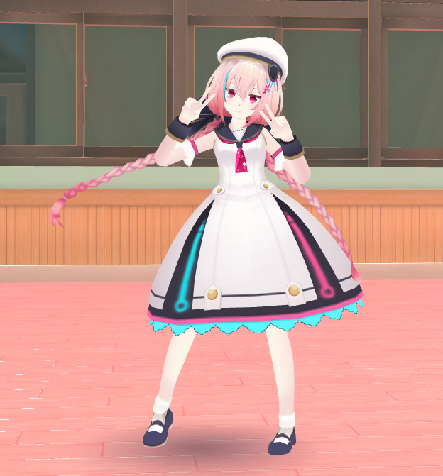

# Lib13移行のモーション追加

## 概要

Lib13にて、Canvas資材及びエモートアニメーションがサーバーから取得する形式となり、インゲーム側でこれらの資材を持つことが無くなりました。
これにより、自動で更新がされるようになった一方、シーン独自のUIやエモートの実装を行いたいとなった場合、以前より実装が困難となりました。
本記事では、Lib13以降の環境に於いて、独自エモートを実装する方法について紹介します。

!!! info "検証環境"
    SDKバージョン : 13.7.7 
    OS : Windows 10 
    Unity : 2019.4.31.f1 
    ブラウザ : Chrome

## 事前知識

VketCloudSDK13のAvaterFileには、エモートの欄がありません。

したがって、独自のエモートを正攻法で実装することはできません。

## 代替実装 - モーションを使って実装

モーションタブではモーションの実装が出来ます。
こちらは今まで通り、追加/削除が可能です。

追加したモーションはアクション・HeliScriptで再生可能です。

したがって、「このワールド限定でアバターがこういう動きしてほしい！」は原則、モーションを使って実装します。

### モーション機能では出来ないこと

#### ①エモートパレットからの使用

モーション機能で登録するだけでは、画面右下のエモートパレットからアニメーションを選んで使用することが出来ません。

#### ②エモートアイコンの表示

エモートを使用した場合、プレイヤーの上部にアイコンが表示されますが、モーションの場合、表示されません。

