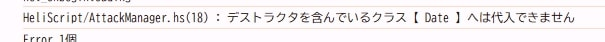

# [HeliScript - Knowledge] Special Specifications of the Date Type

## Overview

The `Date` type available in HeliScript has some unique characteristics in the current Lib14 environment.  
This article introduces these special specifications and provides solutions.

!!! info "Environment"
    SDK Version: 14.2.1  
    Lib Version: 14.4  
    Unity: 2022.3.6.f1  

## Initialization

When assigning the earliest value to the `Date` type:

```javascript
Date _newDate;
_newDate = hsCreateDateUTC(0,0,0,0,0,0,0);
```

This will not assign the expected value (it will instead use the current timestamp).  

Instead, specify `1970-01-01 00:00:00.000` explicitly as follows:

```javascript
Date _newDate;
_newDate = hsCreateDateUTC(1970,1,1,0,0,0,0);
```

## Date Type Lists Do Not Function Properly

When creating a list of `Date` type, attempting to assign `Date` objects (e.g., using `hsCreateDate()`) to list elements results in the error:

> "Cannot assign to class `Date` containing a destructor."



To create a list of dates, use a list of `string` instead. Convert `Date` to `string` using `ToString()`, and when you need to use them as `Date` objects, parse them back with `hsParseDate()`.

```javascript
// Creating a "Date type list" (workaround)
list<string> _dateList;
_dateList = new list<string>(10);

// Initializing the list
for(int i = 0; i < _dateList.Count(); i++) {
    _dateList[i] = hsCreateDateUTC(1970,1,1,0,0,0,0).ToString();
}

// Using the "Date type list" (workaround)
Date _date;
int _index;

_index = 5;

// Retrieve the 6th element of the "Date type list" (workaround)
_date = hsParseDate(_dateList[_index]);
```

## Precautions When Initializing with `string`

When using `hsParseDate()` to create a `Date` object from a `string`, if the `string` is empty, a `Date` object with `null` content will be created.  

Use `hsCreateDateUTC(1970,1,1,0,0,0,0).ToString()` or similar to ensure valid content is stored in the `string` variable.