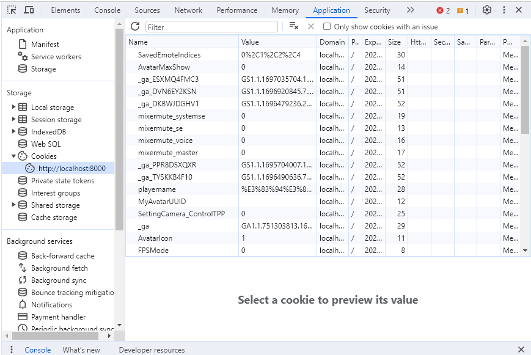

# How to Handle Issues Where Errors Are Not Displayed

Issues where errors are not displayed often occur because the program is functioning correctly, but there is a misconfiguration. Therefore, checking the following points can help resolve the issue.

## ① Differences from a Normal Environment

Compare it with an environment where it works correctly and determine why it does not work in your case.

## ② Checking the Network Tab

For loading-related issues, checking the network tab can help narrow down the cause. Look at how far the loading process has progressed, which JSON file was last loaded, and which JSON file was attempted next.

## ③ Checking Cookies

Cookies can sometimes cause unexpected behavior.
In the developer tools' application tab, you can see the cookies stored for the page.
Check this area for clues about the issue.

Since localhost contains a mix of cookies from various environments and projects,
it is also important to check how the behavior changes when using an incognito window.

## ④ Question Your Assumptions

This is the most important point.

Assumptions like "Since it’s deployed, the local and development environments must be the same" or "The disappearance of a button after modifying a JSON file must mean the JSON file is the cause" can often mislead you away from the real issue.

When faced with an abnormal phenomenon where the system does not work correctly despite no errors appearing, it is essential to question these "common sense" assumptions and investigate from multiple perspectives.

Understanding VketCloud is necessary for proper investigation and troubleshooting. If you have any questions while reading this manual, feel free to ask on the VketCloud Discord server.
