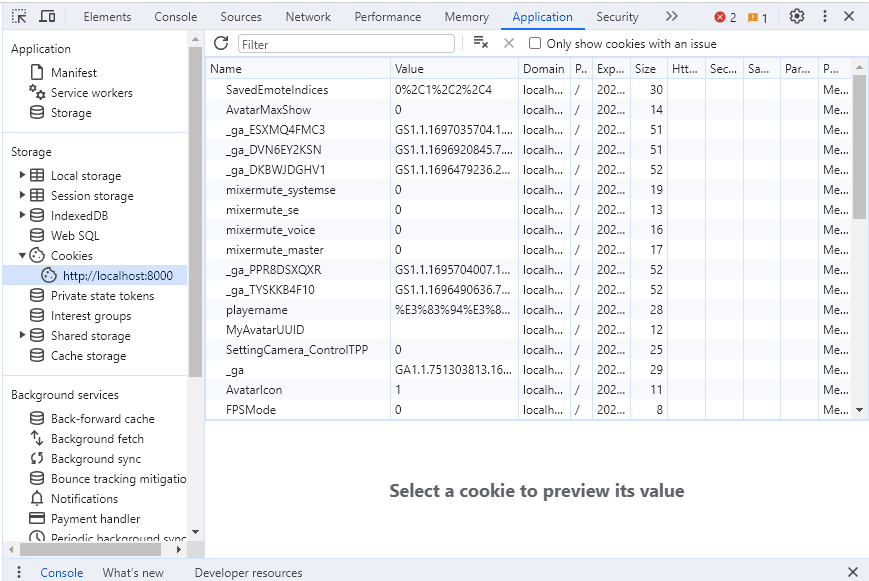

# エラーが表示されない不具合への対処法

エラーが表示されない不具合は、プログラム的には正常に動作しているが設定がおかしいため発生していることがほとんどです。したがって、下記を確認することで改善が見込まれます。

## ①正常な環境との差分

正常に動く環境と比較し、何故動かないかを確認します。

## ②ネットワークタブの確認

読み込み関連の不具合はネットワークタブでどこまで読み込みができているか、最後に読み込んだファイルを読み込むためのjsonファイルは何か、その次に読み込もうとしたjsonファイルは何かといった部分を見ることで、原因をある程度絞り込めます。

## ③Cookieの確認

Cookieにより動作がおかしくなることがあります。
デベロッパーツールのアプリケーションタブでページで保存されているCookieが分かるので、
ここで不具合の手がかりを探しましょう。

localhostは、様々な環境や案件のcookieが入り混じっているので、
シークレットウィンドウを使った時どうなるか、といったことについても要確認です。

## ④常識を疑う

これが一番大事です。

「デプロイされているからローカル環境と開発環境は同じものだろう」、「jsonファイルの操作で他のボタンの表示が消えたから、原因はjsonファイルにあるだろう」といった思い込みが、原因から遠ざかる一因となることは多々あります。

エラーは出ていないのに正常に動作しないという常識では考えられない現象に対しては、その「常識」を疑ってあらゆる視点から調査・検証をすることが大事です。

調査や検証を行う上でVketCloudに関する知識が必要となるので、本マニュアルを読んで分からない点はお気軽にVketCloudDiscordサーバーでお問い合わせください。

