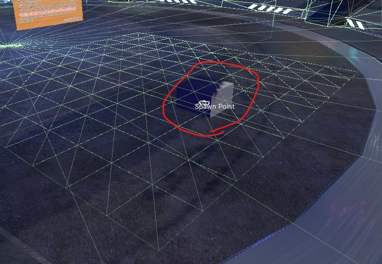

# MeshColliderとHEOAreaColliderを持つコライダーが重なっていた場合、HEOAreaColliderが動作しない

## 現象
MeshColliderとHEOAreaColliderを持つCubeが重なっている時、HEOAreaColliderに設定したいかなるActionも動作しなくなる。

確認環境では、パーティクルの再生を行うようにしていたが、再生されなかった。

!!! info "発生環境"
    SDKバージョン : 4.1.1  
    OS : Windows 10  
    Unity : 2019.4.31.f1  
    ブラウザ : Google Chrome

## 解決までに試したこと
### ① HeliScriptでの再生

Item.Play()を使い、該当のパーティクルの再生を試みたが、正常に再生ができた。

### ② Cubeの当たり判定の位置を調整

Cubeの位置を変更し、入退室が行えたことを分かりやすくしたが、それでも再生されなかった。

### ③ スポーン地点をエリアコライダーの外に移動

エリアコライダーの中に入ることで再生される動作を見やすくしたが、再生されなかった。

### ④ MeshColliderを削除

以前、MeshColliderのせいでジャンプが行えなかったことがあった。
MeshColliderを非Active化し除外することで、動作の改善が見込めるのではないかと考えた。

## 結論

MeshColliderを削除することで正常にAreaColliderが動作するようになった。
したがって、AreaColliderとMeshColliderが重なっていた場合、AreaColliderの動作が発生しない場合がある。
