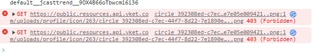

# Solution to Profile Image Error When Creating an Account on Old MyVket

## Issue

If you create an account on the old MyVket and enter a world without updating yourprofile, an error like the one in the image below may occur within the world. 

This error not only affects the person who created the account but also other usersin the room. 
The implementation causes all processes to stop due to a communication failure, soafter the error occurs, dynamic loading and other in-game features will no longer function.

!!! info "Environment"
    Issue: MyRoom
    SDK Version: 8.2
    OS: Windows 10
    Unity: 2019.4.31.f1
    Browser: Google Chrome

## Steps Taken to Resolve

- Update Profile
    - Update the profile image on MyVket.

## Conclusion

If you created an account on the old MyVket, it's recommended to update both your profile image and other details. The issue seems to occur under certain conditions when setting the profile icon in-game.
