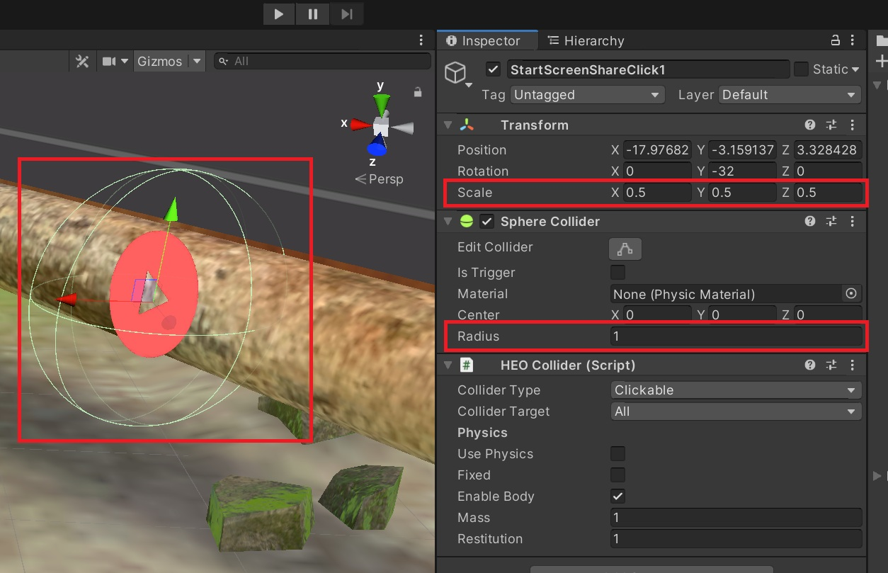
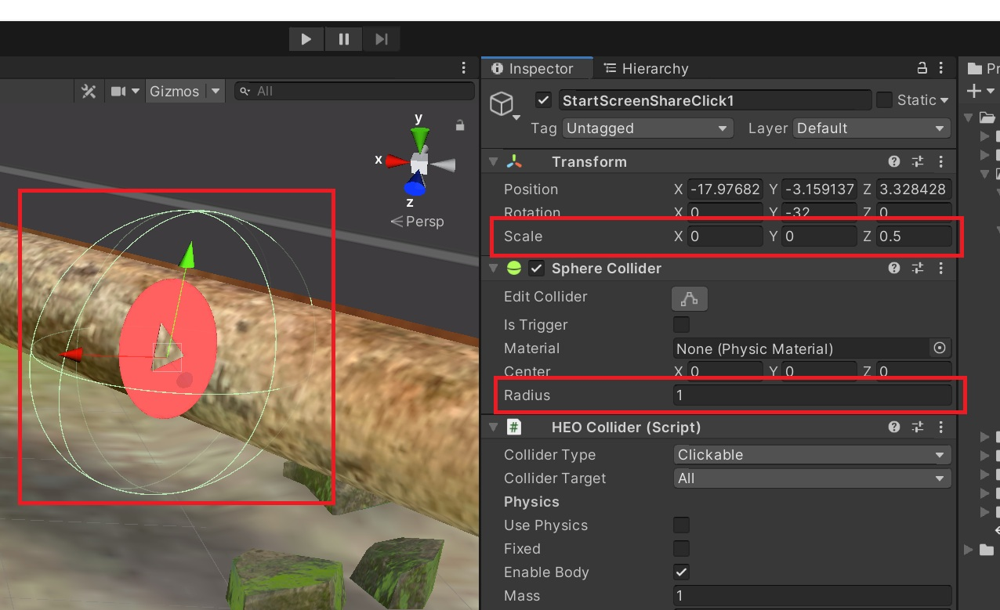
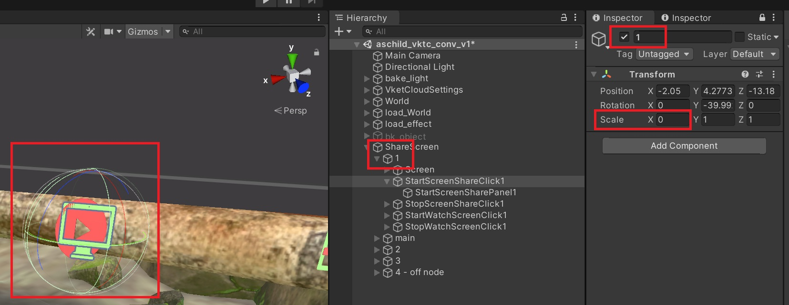

# Solution for When Clicking on Sphere Collider Does Not Respond

## Issue
Clicking on the Sphere Collider does not elicit any response.

## Cause
The scale values of the GameObject with the Sphere Collider are not the same for X, Y, and Z.

## Solution
Align the scale values of the GameObject.

## Pitfall
As shown in the figure below, in the "Non-responsive Case," the apparent size of the Sphere Collider is the same as in the "Normal Case," but it becomes non-responsive.

### Normal Case

*Scale values are all 0.5*

### Non-responsive Case

The apparent size (green sphere) does not change, but it becomes non-responsive.

*Scale values for x and y are 0*

## Additional Information
It is not a problem if the scale value of the parent GameObject of the GameObject with the Sphere Collider is small.

*Scale.x = 0 but still responds*

