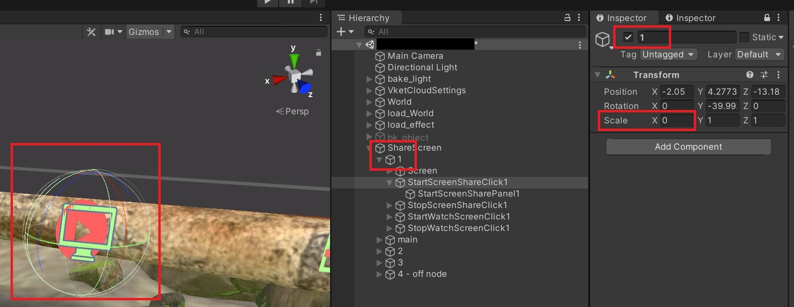

# SphereColliderをクリックしても反応しない場合の解決方法

## 現象
Sphere Colliderをクリックしてもなぜか反応がない。

## 原因
Sphere Colliderが付いているGameObjectのスケール値が小さい。

## 解決方法
GameObjectのスケール値をそろえる。

## 罠
下図のように「反応しないケース」では、Sphere Colliderのみための大きさは「正常なケース」と変わらないが、反応しなくなる。

### 正常なケース

※Scaleが全て0.5

### 反応しないケース

見た目の大きさ(緑球)は変わらないが反応しなくなる。

※scaleのx, yが0

## 補足
Sphere Collider付のGameObjectの親GameObjectのスケール値が小さくても問題ない。

※scale.x = 0だけど、反応する

