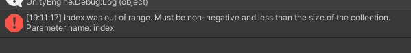

# "Index was out of range. Must be non-negative and less than the size of the collection." Error Displayed During Build

## Phenomenon

When an object with a mesh that does not use UV2 is attached to a Mesh and uses a Mesh Renderer, an error occurs during the build, and the following error is displayed in the console.

## Environment
SDK Version: 4.1.1
OS: Windows 10
Unity: 2019.4.31.f1
Browser: Google Chrome

## Attempts to Resolve

Comparison of settings between objects that build successfully and those that cause errors.
Since the error was unfamiliar, I compared the settings of the mesh object with those of an object that built successfully.

| Object that built successfully | Object that caused the error |
| ---- | ---- |
|  |  |

Upon comparison, I noticed the absence of UV2.
The cause of the error was attempting to use a MeshRenderer without UV2.

## Conclusion
Attempting to handle a mesh without UV2 using a MeshRenderer results in a build error.

Request the modeling team to recreate the mesh to include UV2,
use a SkinnedMeshRenderer,
or apply the texture to another object.

## Additional Insights
Even meshes without UV2 can pass the build and be reflected in VketCloud by using a SkinnedMeshRenderer.

!!! info
    Objects using SkinnedMeshRenderer cannot be animated with hem animation. Therefore, if you want to create objects that move with animation, address this by recreating the mesh.