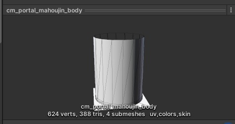

# ビルド時に"Index was out of range. Must be non-negative and less than the size of the collection."が表示される

## 現象

UV2が用いられていないメッシュのオブジェクトがMeshにアタッチされており、Mesh Rendererを利用している場合、ビルド時にエラーとなり、下記画像のエラーがコンソールに表示される。

## 発生環境
SDKバージョン : 4.1.1
OS : Windows 10
Unity : 2019.4.31.f1
ブラウザ : Google Chrome

## 解決までに試したこと

正常にビルドできるオブジェクトと設定の比較
見慣れないエラーだったので、メッシュオブジェクトの設定を正常にビルドできたオブジェクトと比較した。

| 正常にビルドできたオブジェクト | エラーが発生したオブジェクト |
| ---- | ---- |
|  |  |

見比べたところ、uv2の表示がない事に気が付いた。
エラーの原因はuv2がないのにMeshRendererを使用しようとしていたことだった。

## 結論
uv2のないメッシュをMeshRendererで扱おうとするとビルドエラーになる。

uv2を含むようにモデリング班にメッシュの作り直し依頼を行うか、
SkinnedMeshRendererを使用するか、
テクスチャを別のオブジェクトに貼り付けて使おう。

## その他知見
uv2を含まないメッシュであっても、SkinnedMeshRendererを用いることでビルドが通り、VketCloudに反映可能。

!!! info
    SkinnedMeshRendererを用いたオブジェクトはhemアニメーションで動かすことができないため、アニメーションで動かすオブジェクトを作成したいときはメッシュの作り直しで対応しましょう。
