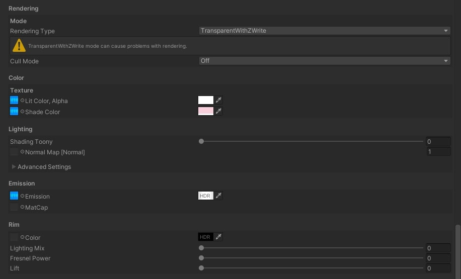

# [Practical / Unity] Procedure for Porting Animation Shader Materials for VRChat to Vket Cloud

## Issue

The animation shader material "FX/FlareSC" for VRChat is not compatible with Vket Cloud.
To reproduce the effect using shaders supported by Vket Cloud, a series of steps is required.

On the left, the top part shows a cyan display, but when the object is implemented as is, the cyan display disappears. 
The cyan display rotates continuously.

!!! info "Environment"
    SDK Version: 4.1.1  
    OS: Windows 10  
    Unity: 2019.4.31.f1  
    Browser: Google Chrome

# Procedure
## ① Download GIMP
The images used in FlareSC have black set as the transparent color.  
Download GIMP from [窓の杜](https://forest.watch.impress.co.jp/library/software/gimp/) and set black as the transparent color.

If you have another image editing tool with similar functionality, this step is unnecessary.

## ② Load the Image
Launch GIMP and drag & drop the image to open it.

If this dialog appears, select "Convert."

The image will now be displayed in GIMP.

## ③ Set "Color to Alpha"

From the "Colors" tab, select "Color to Alpha."

In the Color window, set the color to black (RGB#000000) and click "OK."

The image will become transparent.

## ④ Export the Image

From the File tab, select "Export As."

Rename the file as needed and select "Export."

No additional settings need to be changed on this screen; simply select "Export."

## ⑤ Prepare MToon
The following steps will be performed in Unity.  
For shaders compatible with Vket Cloud, use "VRM/MToon."

You can install this from the Extensions tab in the Vket Cloud SDK settings.

## ⑥ Configure MToon

Change the Shader setting for the material to "VRM/MToon."  
You can find it by searching for "MT."

Adjust the settings as shown in the image.

!!! info "Important Points"
    - Mode: Change to TransparentWithZWrite  
    - Color Emission: Replace textures with those created in GIMP  

The animation settings are the most crucial part.  
Adjust the horizontal and vertical scrolling speeds with Scroll X and Scroll Y.

You can check the animation by entering Play mode.  
Depending on the SDK version, logging into Vket Cloud may be required when entering Play mode.

Finally, build the project and verify that it works.

# Conclusion

By using MToon, it is possible to partially replicate animation shaders designed for VRChat!

# Additional Notes

It also works when exported as HEOObject.

# Related Links

Official GIMP Page: [GIMP](https://www.gimp.org/)  
Official MToon Page: [Releases · Santarh/MToon](https://github.com/Santarh/MToon/releases)
