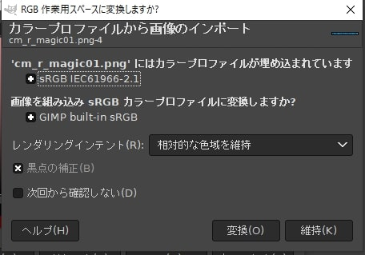
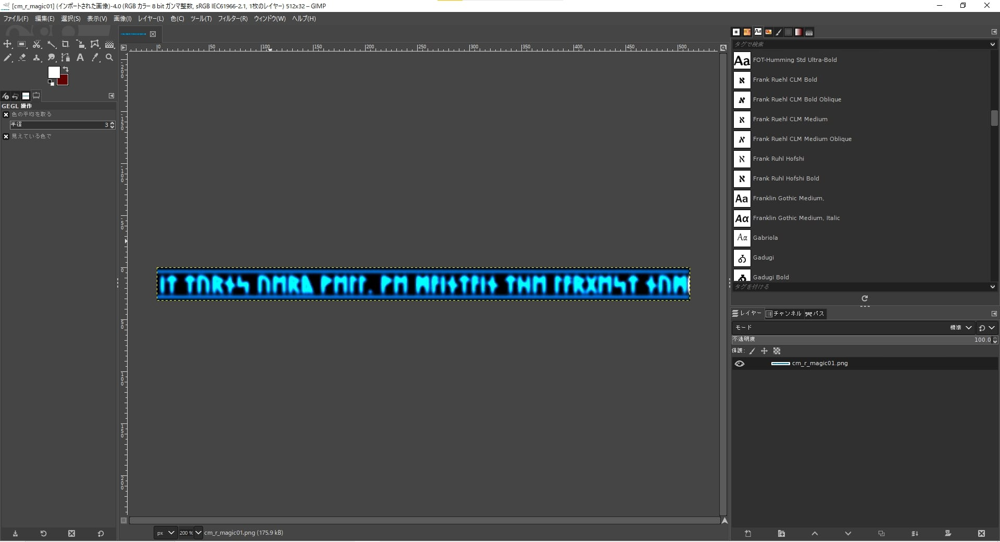
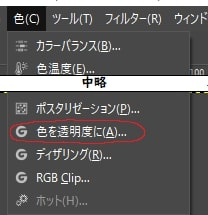
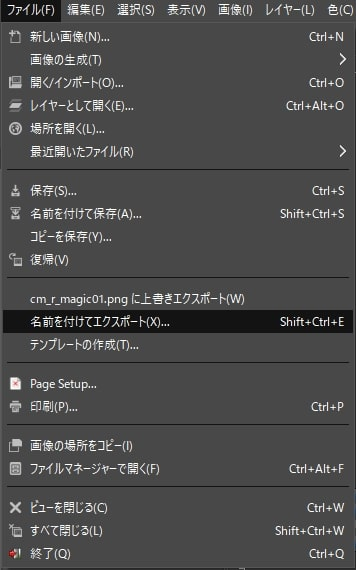
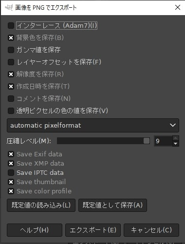
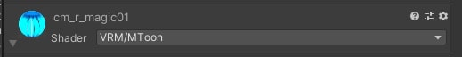

# 【実務 / Unity】VRChat用のアニメーションシェーダー素材をVketCloudに移植する手順

## 現象

VRChat用のアニメーションシェーダー素材「FX/FlareSC」はVketCloudで使用できない。
VketCloudで使用できるシェーダーで再現するため、いくつか手順を踏む必要がある。

左では上部に水色の表示があるが、オブジェクトをそのまま実装すると水色の表示が無くなる。
水色の表示は常に回転している。

!!! info "発生環境"
    SDKバージョン : 4.1.1  
    OS : Windows 10  
    Unity : 2019.4.31.f1  
    ブラウザ : Google Chrome 

# 手順
## ①GIMPのダウンロード
FlareSCで用いられている画像は、黒が透過色に設定されています。 
[窓の杜](https://forest.watch.impress.co.jp/library/software/gimp/) でダウンロード可能なGIMPを使用して、透過色を黒に設定していきます。

同じ機能を持つ画像編集ソフトがある場合、不要です。

## ②画像の読み込み
GIMPを起動し、画像をドラッグ&ドロップで開きます。

このような表示が出た場合、「変換」を選択します。

画像がGIMP上に表示されます。

## ③「色を透明度に」の設定

色タブの下部にある「色を透明度に」を選択します。

Colorウィンドウを選択し、色を黒(RGB#000000)に設定し、OKを選択します。

画像が透過されます。

## ④画像の書き出し

ファイルタブから「名前を付けてエクスポート」を選択します。

名前を元の名前と変更し、エクスポートを選択します。

この画面では何も設定を変更せず「エクスポート」を選択して問題ないです。

## ⑤MToonの用意

ここからはUnityでの操作となります。
VketCloudで動くシェーダーは「VRM/MToon」を使用します。

VketCloudSDK設定の、拡張からインストール可能です

## ⑥MToonの設定

該当マテリアルのShader項目をVRM/MToonに変更しましょう。
MTで検索をかけると出てくると思います。

設定を画像のように変更していきます。

!!! info "重要な点"
    Mode : TransparentWithZWhiteに変更
    Color Emitssion : 各テクスチャをGIMPで作った物に変更

最も重要なアニメーション設定です。
Scroll X Scroll Yで横方向/縦方向のスクロール速度を調整することができます。

動いている様子はPlayモードにすることで確認可能です。
SDKのバージョンによってはPlayモードにした瞬間VketCloudのログイン認証が発生することがあります。

最後にビルドして動くことを確認したら完了です。

# 結論

MToonを使えばVRC用のアニメーションシェーダーもある程度動かせる！

# その他知見

HEOObjectに書き出しても動きます。

# 関連リンク

GIMP公式ページ [GIMP](https://www.gimp.org/)
MToon公式ページ [Releases · Santarh/MToon](https://github.com/Santarh/MToon/releases)
