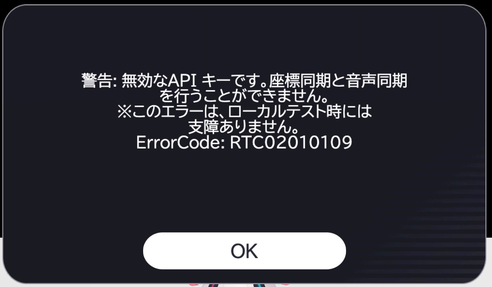
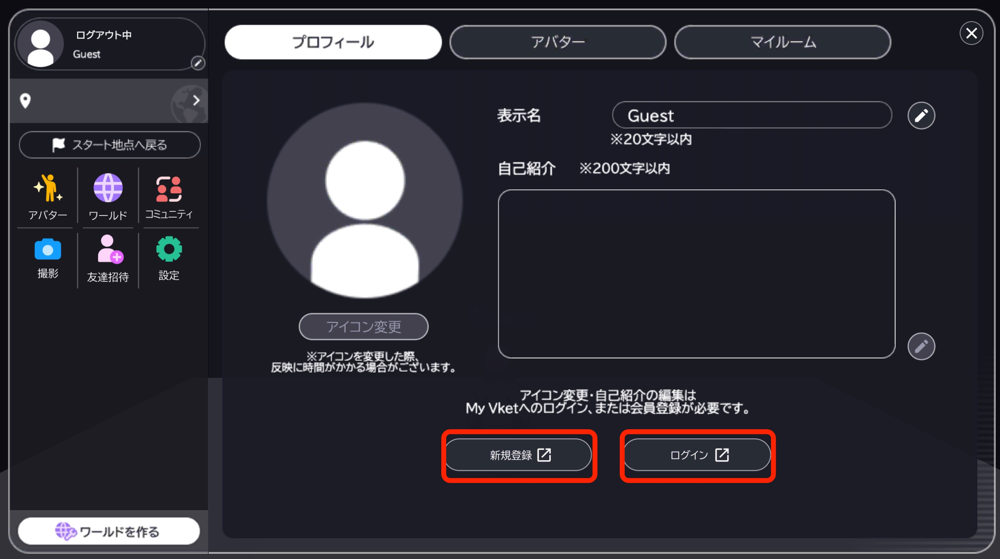

# Build and Run

To check and test the created world,the world can be entered in local environment by running "Build and Run".

## How to build / Build Options

To build a scene with Vket Cloud SDK, make sure you have placed the [required components](WorldBasicComponents.md) and initiate the build from Vket Cloud SDK > Build And Run.
  

!!! note question "If you can't build"
     There may be various reasons causing the build error. Please refer to [Troubleshooting](../troubleshooting/BuildError.md).

!!! caution "Troubleshooting Errors"
    If an error occurs when running a HeliScript during world loading or by trigger, the error will be displayed on the debug log and browser console. 
    Please enable the [Debug Mode](../WorldEditingTips/DebugMode.md) to show the debug log. 
    As the debug log will be hidden during world loading, please see the [Browser Console](../troubleshooting/BuildError.md#checking-the-error-log) for checking the reason of loading error.

!!! caution "Login and API connection are not available on local build"
    In the local environment, the login function and API connection function are not available. 
    If the function requires connection with the API, please upload the world to check.

!!! caution "Login and API connection are not available on local build"
    In the local environment, the login function and API connection function are not available. 
    If the function requires connection with the API, please upload the world to check.
    
    

    The registration and login features that are unavailable are shown below. 

    

    For features that require an API connection or login features, please upload your world to test them.

!!! note "Build Options"
    The build options on Vket Cloud SDK > Settings > "Build" can designate settings such as auto texture compression on build. 
    For details, refer to [Build Options](../WorldEditingTips/BuildOptions.md).

On build options, the creator can set various settings for world assets on build.

To edit build options, Open Vket Cloud SDK > Settings, and select the "Build" tab.

If the build succeeds, the browser will automatically open. Please check if the contents of the scene are properly reflected.

!!! note tip "Clear Cache"
    The build cache stored in the Vket Cloud SDK will be overwrited every build, therefore clearing cache is unrequired. 
    However, some build errors may be related to the cache in rare cases such as after upgrading the SDK, so consider clearing cache in such situation. 
    - Vket Cloud SDK > Clear Cache 
    Also, by selecting - Vket Cloud SDK > Build Option > Auto Clear Cache, the clear cache may be enabled before every build. This setting is not required on usual builds.

## What happens on running "Build and Run""

Running "Build and Run" will convert objects with the [VKC Item Field](../VKCComponents/VKCItemField.md) component and all its child objects into a .heo file format. ".heo" is a 3D file format used exclusively by Vket Cloud's drawing engine.

The built files are then copied to the `[project name]\release\data` folder. This folder will contain all the assets needed to run the world in a browser.

### Overview of release folder  

|  Location  |  File  |  Description  |
| ---- | ---- | ---- |
|  \release  |  main.html  |  Open this html in your browser to start the 3D world  |
|  \release\data\Field\ [world name]\ [object name]  |  [object name].heo  |  3D object in the world  |
|  \release\data\Scene  |  [world name].json  |  Scene data that describes the world setup  |

Note that the act of uploading a manually altered release folder is **strictly prohibited** by license terms of use. Please use it only as one of the debugging means.
