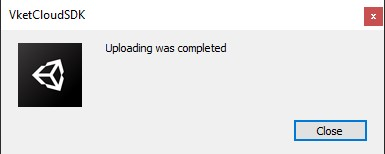
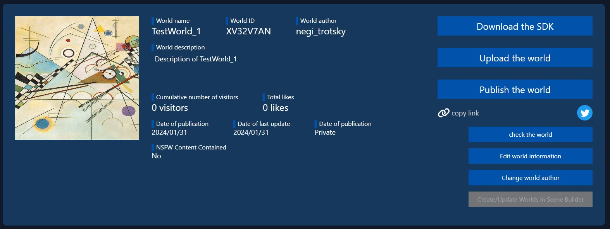

# World upload
You can upload directly from Unity to HIKKY's official world portal server using the SDK.

## How to upload
  
1. Click "VketCloudSDK" and choose "Upload to Remote Server" in the top menu.

     

2. A pop-up will open on Unity. Select the world name to upload.

     

3. A dialog will appear when the upload is complete.

     

4. To enter the uploaded world, click `check the world` from the World ID management screen.

     

!!! note caution
     To upload the world data, the world ID must be created in advance on the account management screen. If you don't see your world name in the list, please create a world ID from [here](https://cloud.vket.com/account/world){target=blank}.

     