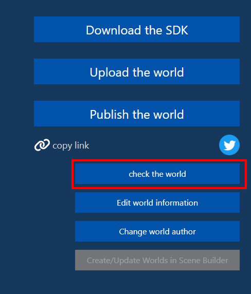

# ワールドアップロード / World Uploaderの使い方

ワールドの制作が完了したら、公開のためにVket Cloud / My VketのサーバーへSDKの機能を使ってアップロードすることができます。

また、ワールドが非公開の状態で複数人でワールドテストを行いたい際もアップロードを行う必要があります。

## アップロード方法
  
1. メニューの「VketCloudSDK」から「Upload to Remote Server」をクリックしてください。

    

2. 「Upload to Remote Server」をクリックすると、World Uploaderウィンドウが開かれます。

    ここでは[Vket Cloud](https://cloud.vket.com/account/world){target=blank}公式サイトにてあらかじめ発行したワールドIDとそれに紐づいている情報（ワールド名、サムネイル、ワールド説明）が一覧表示されます。

    アップロードしたいワールドIDを選択してください。

    

    また、[Basicプラン](https://cloud.vket.com/plan){target=blank}以上のライセンスを使用している場合、チーム制作機能が解放され所属チームと管理しているワールドの表示の切り替えが左上のチーム名より行えます。

    

    "Check the World"を選択すると、アップロードされたワールドが確認できます。 
    まだアップロードされていない初回の状態では何も表示されないためご注意ください。

    

    "Upload"を選択すると、アップロードを行うか確認するウィンドウが表示されます。 
    "Yes"を選択するとアップロードが開始されます。

    

3. アップロードが完了すると以下のように成功した旨のダイアログが表示されます。

    

4. アップロードしたワールドへ入室するには、[ワールドIDの管理画面](https://cloud.vket.com/account/world){target=blank}から`check the world`をクリックしてください。

    

    また、World Uploader内の"Check the World"を選択しても同様にアップロードされたワールドが確認できます。

    

!!! caution "アップロードの反映タイミングについて"
    サーバーの内部処理・通信環境によって、アップロードされたワールドの更新に5~15分程度かかります。 
    アップロード / ワールド更新後に`check the world`を選択し、ワールドの更新が反映されていない際はしばらくお待ちください。

## ワールドの公開について

公開されたワールドは、My Vketの[ワールド一覧](https://vket.com/play/world){target=blank}にて一覧化されて表示されます。

また、非公開の状態でURLを共有すると、My Vketでは非公開の状態でワールドにアクセスできるようになります。 
複数人でのテスト、限定的な公開を行いたい際に有効です。

!!! note caution
    アップロード先ワールドは、アカウント管理画面であらかじめIDだけ作成しておく必要があります。 
    リストにワールド名が表示されない場合は、[こちら](https://cloud.vket.com/account/world){target=blank}よりワールドIDを作成してください。

!!! caution "複数シーンのアップロードについて"
    同プロジェクトで2つシーンを作成し、それぞれ別のワールドにアップロードした際、先にアップロードしたワールドが2つアップロードされてしまう事があったり、アップロード後に入場を試みた際に404 / ビルドエラーとなってしまうことがあります。 
    本現象の防止としては、異なるワールドのシーンを同じプロジェクトで管理しないようにすることが考えられます。 
    また、本現象が生じた場合は、プロジェクトを閉じた上でプロジェクトフォルダー内のuploadフォルダを削除し、プロジェクトを再起動して再アップロードを行う必要があります。
