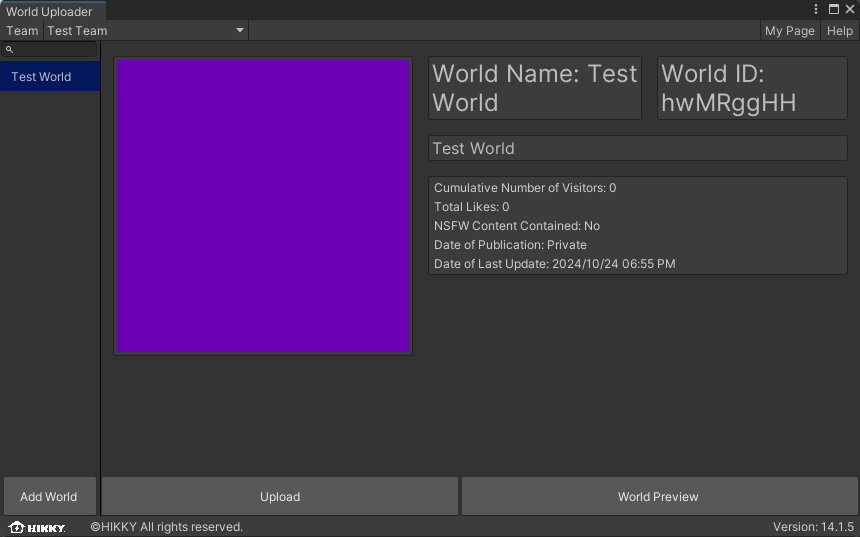
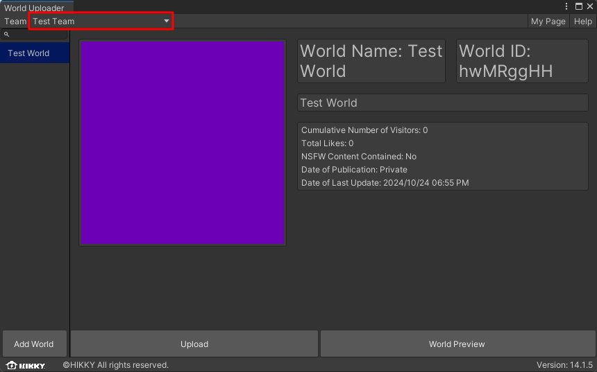
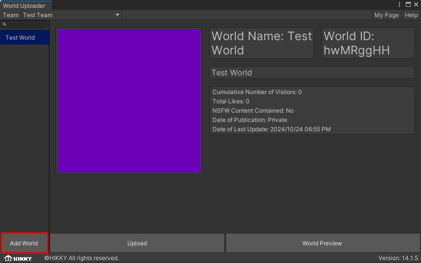
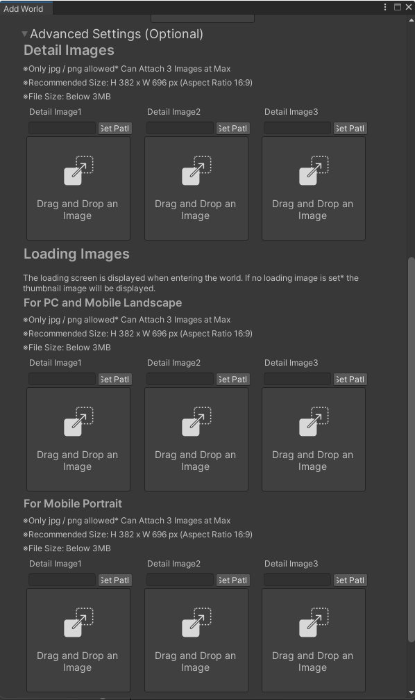
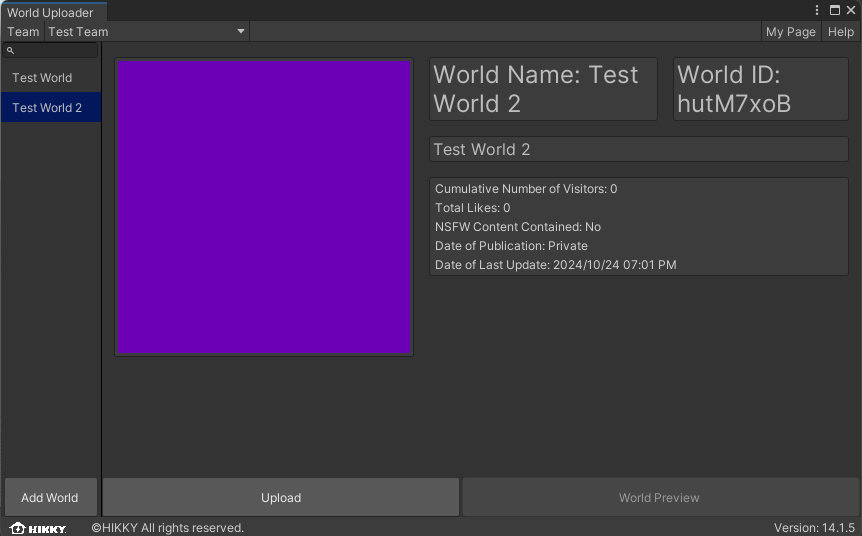

# ワールドアップロード

ワールドの制作が完了したら、公開のためにVket Cloud / My VketのサーバーへSDKの機能を使ってアップロードすることができます。

また、ワールドが非公開の状態で複数人でワールドテストを行いたい際もアップロードを行う必要があります。

## アップロード方法
  
1. メニューの`Vket Cloud SDK`>`Upload to Remote Server`をクリックしてください。

    

2. `Upload to Remote Server`をクリックすると、World Uploaderウィンドウが開かれます。

    ここでは[Vket Cloud](https://cloud.vket.com/account/world){target=_blank}公式サイト、もしくは後述の「[ワールド情報の新規登録](#_3)」にて発行したワールドIDとそれに紐づいている情報（ワールド名、サムネイル、ワールド説明）が一覧表示されます。

    

    また、[Basicプラン](https://cloud.vket.com/plan){target=_blank}以上のライセンスを使用している場合、チーム制作機能が解放され所属チームと管理しているワールドの表示の切り替えが左上のチーム名より行えます。

    

    `World Preview`を選択すると、アップロードされたワールドが確認できます。 
    まだアップロードされていない初回の状態では何も表示されないためご注意ください。

    

### ワールド情報の新規登録

SDK Ver14.1から、これまで[Vket Cloud](https://cloud.vket.com/account/world){target=_blank}公式サイト上で行っていたワールドIDの発行 / 情報登録がSDK上で行えるようになりました。

1. ウィンドウ左下の`Add World`をクリックしてください。

    

2. `Add World`をクリックすると、ワールド情報を登録するためのウィンドウが開きます。 
    ウィンドウの案内に沿って以下の情報を入力してください。

    - 所属チーム ※[Basicプラン](https://cloud.vket.com/plan){target=_blank}以上のライセンスにて切り替え可能
    - ワールド名
      - 30文字まで入力可能
    - ワールド説明
      - 500文字まで入力可能
    - ワールドサムネイル画像
      - jpg / png画像
      - 推奨サイズ：382px × 696 px (比率 16:9)
      - ファイルサイズ：3MB以下

    

3. `Advanced Settings (Optional)`タブを開くと、追加で詳細情報を加えることができます。

    - ワールド詳細画像
    - ロード画面用画像　※設定のない場合は代わりにサムネイル画像が使用されます。
      - PC / モバイル横画面用
      - モバイル縦画面用

    

4. 全ての情報を入力し終えたら、`Create World`をクリックして情報を送信します。

    

5. ワールド情報の登録が完了すると、完了を示すウィンドウが表示され、ワールド情報一覧にて情報を確認できます。 
  登録した情報を編集したい場合は、公式サイトの[ワールド管理ページ](https://cloud.vket.com/account/world){target=_blank}にて確認と編集を行ってください。 
  ワールド管理ページは、ウィンドウ右上のMy Pageボタンからもアクセスできます。

    

    

### ワールドデータをアップロードする

1. アップロードしたいワールドIDを選択してください。

    

2. `Upload`を選択すると、アップロードを行うか確認するウィンドウが表示されます。 
    `Yes`を選択するとアップロードが開始されます。

    

    

3. アップロードが完了すると以下のように成功した旨のダイアログが表示されます。

    

4. アップロードしたワールドへ入室するには、[ワールドIDの管理画面](https://cloud.vket.com/account/world){target=_blank}から`World preview`をクリックしてください。

    

    また、World Uploader内の`World preview`を選択しても同様にアップロードされたワールドが確認できます。

    

!!! warning "アップロードの反映タイミングについて"
    サーバーの内部処理・通信環境によって、アップロードされたワールドの更新に5~15分程度かかります。 
    アップロード / ワールド更新後に`World preview`を選択し、ワールドの更新が反映されていない際はしばらくお待ちください。

!!! note "アップロード時のビルドオプションについて"
    [Vket Cloud SDK Settings](../SDKTools/VketCloudSDKSettings.md)では、Build & Run及びワールドデータのアップロード時にエンジン側でファイルを圧縮するか否かを[設定できる機能](../WorldEditingTips/BuildOptions.md)があります。 
    本機能を使うことによって、スマートフォンなど軽量さが要求される環境での動作を改善させられます。 
    アップロードにかかる時間が長い・ビルドに失敗する場合は本設定を見直すか、[ビルドエラー / ワールドが動かないときは](../troubleshooting/BuildError.md)をご参照ください。

## ワールドの公開について

ワールドの公開状態は、以下の三種類から選択して設定が可能です。

!!! note "ワールドの公開設定"
    公開：ワールドは全ユーザーに公開されます。 
    限定公開：URLを知っている人のみアクセス可能です。検索エンジンには表示されません。 
    非公開：チームメンバーのみアクセス可能です。

「公開」に設定されたワールドは、My Vketの[ワールド一覧](https://vket.com/play/world){target=_blank}にて一覧化されて表示されます。

また、「限定公開」に設定されたワールドへはURLを知っているユーザーのみ入場できます。
「非公開」に設定されたワールドへはそのワールド作成者のライセンスのチームに所属するメンバーのみ入場できます。
複数人でのテスト、限定的な公開を行いたい際に有効です。

新規ワールドIDを作成すると、はじめは非公開ワールドとして作成されます。公開したい場合は、ワールド管理画面より`ワールドの公開設定`を選択し、`公開`を選択してください。

!!! note warning
    アップロード先ワールドは、アカウント管理画面であらかじめIDだけ作成しておく必要があります。 
    リストにワールド名が表示されない場合は、[こちら](https://cloud.vket.com/account/world){target=_blank}の`ワールドを追加`ボタンよりワールドIDを作成してください。

!!! warning "複数シーンのアップロードについて"
    同プロジェクトで2つシーンを作成し、それぞれ別のワールドにアップロードした際、先にアップロードしたワールドが2つアップロードされてしまう事があったり、アップロード後に入場を試みた際に404 / ビルドエラーとなってしまうことがあります。 
    本現象の防止としては、異なるワールドのシーンを同じプロジェクトで管理しないようにすることが考えられます。 
    また、本現象が生じた場合は、プロジェクトを閉じた上でプロジェクトフォルダー内のuploadフォルダを削除し、プロジェクトを再起動して再アップロードを行う必要があります。
