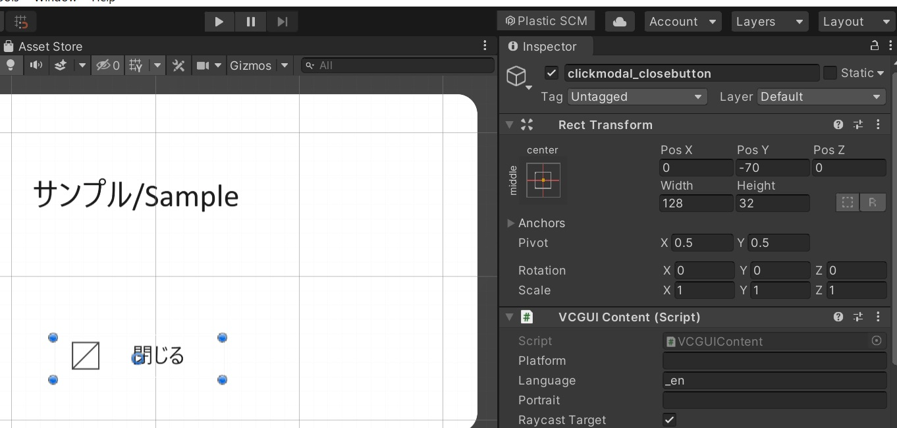

# Advanced Usage

Once you have installed and set up GUITools, you can start placing UI elements.

## General Workflow

1. Load the existing JSON file.
2. Adjust the placement and size of elements.
3. **Export** the JSON file.

We avoid using the GUI Exporter feature because it can disrupt the original JSON file format, doesn't support some features like masks, and removes comments. However, if you are creating a screen from scratch, you may use the Export function.

## About the Inspector

You can adjust the size and position of elements either directly in the Scene or by inputting values in the Rect Transform section of the Inspector.

Clicking the red frame allows you to change the anchor point of the element.

## Adding New Elements

Here is how to add and place new elements in Unity.

First, prepare image assets in sizes that are powers of two.

Open the Project tab, select the folder where you want to place the assets, and right-click to choose "Show in Explorer."

Add the new assets to the opened Explorer folder.

In the Project tab, verify that the added assets do not have the triangle arrow icon.

Click on the added asset and change the Texture Type to Sprite (2D and UI) in the Inspector. Then click the **Apply button**.

Duplicate an appropriate part in the Hierarchy.

Click the circle button next to the Source Image of the duplicated part.

Select the image asset you want to replace from the displayed window.

If the aspect ratio of the image is incorrect, click the Set Native Size button in the Image section to apply the original size of the asset and correct the ratio.

Finally, adjust the position and size to complete the placement!

## JSON Export

Open the GUI Exporter window from the top menu: **VketCloudGUITools > GUI Exporter**, and export the modified Canvas object as a **JSON file** to be used in VketCloud.

### **Heliodor Data Path (Required)**

Specify the folder where the JSON file will be exported (where the Canvas or Field folders are located). **Make sure to specify the "data" folder.**

### **Unity Data Path (Required)**

Specify the folder where textures are saved within the Unity project.  
It should correspond to the location specified in the **Heliodor Data Path's "data" folder**.

### **Target Canvas (Required)**

Specify the **Canvas object** you want to export. The items under this will be exported as one JSON file.  
Unsupported components will be displayed as errors in this window (see "Supported Components" below).

### Auto Generated Layer

If the source UI does not have layers, they will be assigned to the layer specified here.  
If not set, it will be handled by "Auto Fix."

### Auto Fix Settings

Specify the rules for automatically executing "auto-fix" for the errors mentioned below.

### List of Errors

If **auto-fix** is possible, an **Auto Fix** button will appear; press it.  
**Undo is supported**, so if you press it by mistake, don't worry, just press "Ctrl+Z" to undo.

Yellow text: You can auto-fix in any order.

Red text: Elements that can't be reproduced in Heliodor and obviously change the appearance. **Ideally, fix these manually.**  
You can export by ignoring these, but **it may significantly change the design or behavior**.

**Red background red text**: Critical issue. **You cannot export until this is resolved.**  
Auto-fix might be impossible, or the results might vary depending on the order of auto-fix.

Specify any Canvas and press **Export .json** to export.

If the Data Path is set correctly, assets set in Image etc. will be automatically copied (e.g., Assets/gui_test/test.png → the location specified by UnityDataPath/gui_test/test.png).

