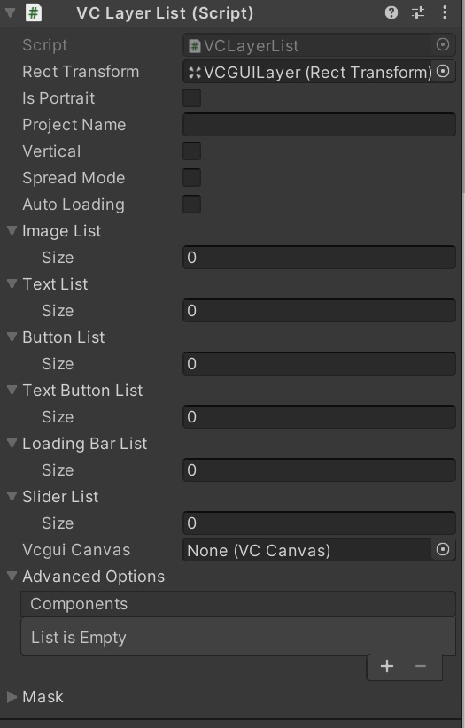
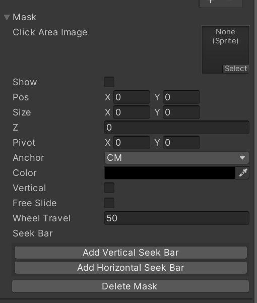

# VC Layer List

| Label         | Default Value | Function                                                                                       |
| -------------- | -------------- | ------------------------------------------------------------------------------------------ |
| Rect Transform |                | Attaches a Rect Transform with adjusted position and size.                                   |
| Is Portrait    | false          | Flag for portrait mode.                                                                      |
| ProjectName    | ""             | String.                                                                                      |
| SpreadMode     | false          | Flag for spread mode in comic viewer.                                                        |
| Auto Loading   | true           | When true, loading starts at initial loading. When false, loading starts after initial loading is complete. This feature shortens the initial loading time. |
| Image List     | []             | Specifies the list of image components.                                                      |
| Text List      | []             | Specifies the list of text components.                                                       |
| Button List    | []             | Specifies the list of button components.                                                     |
| Text Button List | []           | Specifies the list of text button components.                                                |
| Loading Bar List | []           | Specifies the list of loading bar components.                                                |
| Slider List    | []             | Specifies the list of slider components.                                                     |
| Components     | []             | Specifies the component names defined in the script files specified by "Scripts" (multiple can be specified). These components handle event callbacks and other processing. |
| Mask           | false          | Specifies whether to use a mask.                                                             |

## Mask

| Label            | Default Value | Function                                                                                       |
| ---------------- | -------------- | ------------------------------------------------------------------------------------------ |
| Click Area Image |                | Specifies the image for verification.                                                        |
| Show             |                | Shows or hides the verification image.                                                       |
| Pos              |                | Position.                                                                                    |
| Size             |                | Size.                                                                                        |
| Z                |                | Z value.                                                                                     |
| Pivot            |                | Pivot.                                                                                       |
| Anchor           |                | Anchor.                                                                                      |
| Color            |                | Alpha blend of the verification image.                                                       |
| Vertical         |                | Specifies whether the mask scrolls vertically or horizontally.                               |
| FreeSlide        |                | Specifies whether the mask can scroll freely in both vertical and horizontal directions.     |
| WheelTravel      |                | Amount of movement by mouse wheel input.                                                     |
| SeekBar          |                | Settings for attaching a seek bar to the mask. Depending on the values of Vertical and FreeSlide, set the necessary "Vertical" and "Horizontal" parameters. Each element is: “Base”: Specifies the image for the base of the bar. ”Front”: Specifies the image for the front of the bar. ”On”: Specifies the image when the knob is on. “Off”: Specifies the image when the knob is off. ”BarWidth”: Specifies the width of the bar. ”OnSize”: Specifies the size of the knob when on. ”OffSize”: Specifies the size of the knob when off. The seek bar cannot be used for clone lists at this time. |