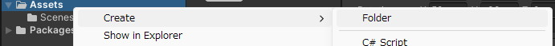
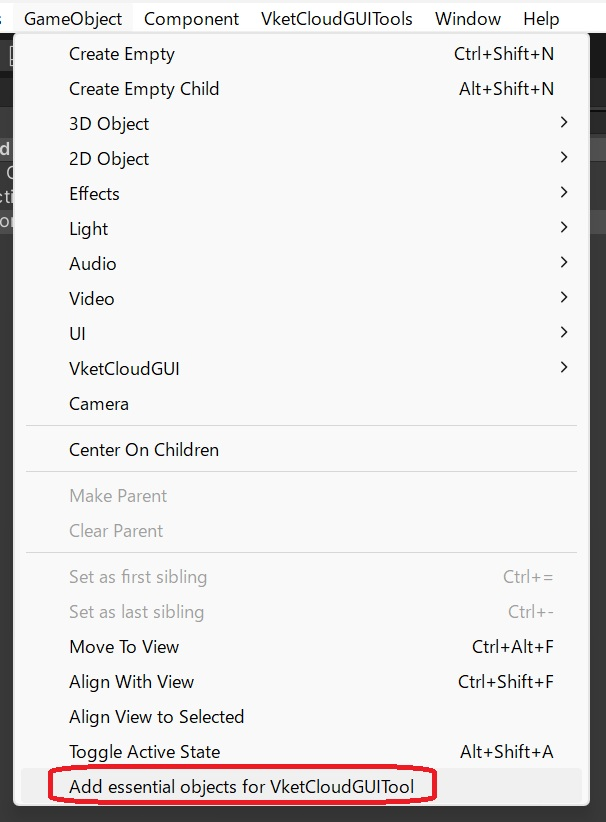
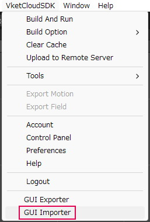
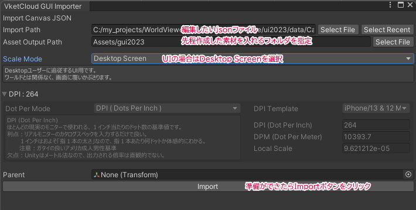
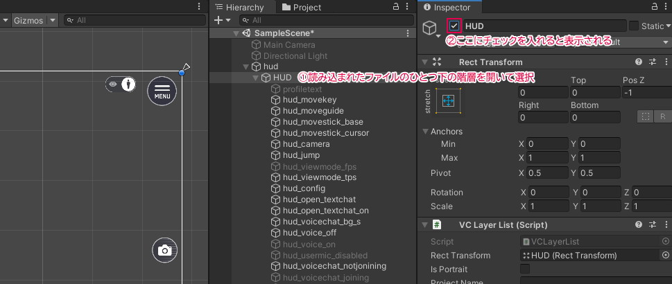
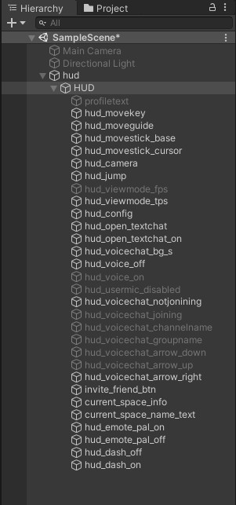
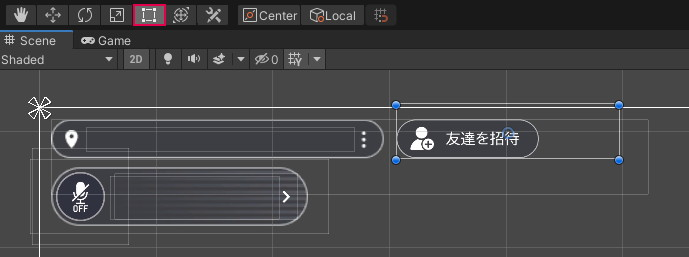
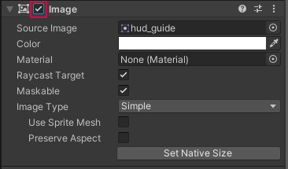

# Basic Usage

## Preparation Before Work

Before working in Unity, change to a layout that is useful for editing 2D UI.
Select Tall from the dropdown menu in the upper right corner, and drag the Project tab of Hierarchy and Project to place it next to Hierarchy.

Turn on the button labeled "2D" in the upper left.

Click the button with a sparkle icon, located three places to the right of the "2D" button, to turn it off.

Turn off

Select Main Camera and Directional Light, then uncheck the checkbox displayed in the Inspector to temporarily hide them.

Open the Project tab, right-click on Assets, and create a folder for UI image materials with Create → Folder. The name can be arbitrary (however, no full-width characters).

## Adding Essential Objects (Template)

Select GameObject > Add Essential objects for VketCloudGUITool from the top menu to add Essential Objects.

## Loading Sample Activity Canvas (Template)

As a second method, install it from the Package Manager with Import Into Project.

It will then be installed into Assets.

## Importing Json File

Click VketCloudGUITools → GUI Importer from the menu.

In the import dialog, set the json file you want to load, the destination for copying materials, and the scale, and proceed with the import.

The json file for the Sample Activity Canvas can be found at the following location, so please select it.

`C:\{UnityProject}\Assets\Samples\VketCloud GUI Tools\13.0.0\Sample\Canvas\landscape\activity_modal.json`

Click Import and close the dialog when you see 100% displayed, indicating completion.

If nothing appears to be displayed after loading, do not panic. Open the hierarchy just below the loaded one in the Hierarchy, select it, and check the top checkbox in the Inspector to display it.

Visibility can be controlled by the top checkbox in the Inspector.

## Navigating in Unity

Although the Hierarchy has a structure similar to layers, unlike Photoshop, items higher in the list are drawn underneath, so be mindful of this.

**Mouse Wheel**  
Zoom in and out of the screen.  
**Right-click Drag of the Mouse**  
Hand tool.  
When editing UI, it's easier to work with the **Rect Tool (square icon)**.

If nothing is displayed even though the top checkbox in the Inspector is checked, make sure the checkbox in the Image section of the Inspector is checked to display the image.