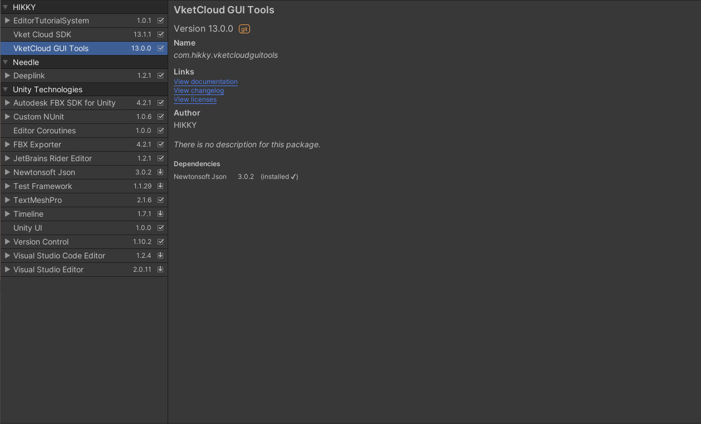

# GUITools - 概要とセットアップ

Vket Cloud SDK外の派生ツールとして、Vket Cloudにて制作したワールドにおける （VKC Item Activity用）Activity Canvas GUIを編集・保存を行うためのGUIToolsがあります。 
ツールとしては大きくGUI ImporterとGUI Exporterに分かれており、ワールド読み込み時にはGUIToolsにて行ったUIへの編集を保存したjsonファイルが参照されます。 
新たにUIを追加した場合はHeliScriptによって操作を定義づける必要があります。詳しくは [応用実装](AdvancedUse.md) および [組み込み関数 - GUI](../hs/hs_system_function_gui.md) をご参照ください。

## A. 下準備

下準備として、[Vket Cloud SDKの導入方法](../AboutVketCloudSDK/SetupSDK_external.md)における手順に沿ってUnityプロジェクトのセットアップとVket Cloud SDKのインストールを行います。

!!! warning "環境導入時の注意点"

    - エディターバージョンは2019.4.31f1もしくは2022.3.6f1になっている

    - 使用するテンプレートは3Dになっている

    - プロジェクト名にSpace、ひらがなカタカナ漢字などの2バイト文字が入っていない

以後、UnityのLayoutは「2 by 3」の状態、ProjectビューはOne Column Layoutの状態で解説を行います。

## B. GUIToolsの導入

Unity上部タブ Edit > Project Settings… を選択します。

Package Managerを選び、+を選択します。
その後、Name、URL、Scope(s)に下記を入力し、Applyを選択します。

| 項目 | 入力内容 |
| ---- | ---- |
| Name | VketCloudSDK_GUITools |
| URL  | https://registry.npmjs.com |
| Scope(s) | com.hikky.vketcloudguitools |

Apply後、Unity上部タブ Window > Package Managerを選択します。

表示タブをMy Registriesにした際、`VketCloudSDK_GUITools`が表示されているはずです。

Installボタンを押すことでインストールされます。

!!! warning "インストールが終わらない場合"

    GUITools v13.0.0をインストール時に、無限にインストールが続く場合があります。

    その場合、Unity プロジェクトを再起動することで、解決することがあります。

## C. UniTask導入

環境によってUniTaskが自動インポートしていない場合があるので、UniTaskをPackageManagerから導入してください。

左上の＋ボタンをクリックし、Add package from git URL… を選択

現れたテキストボックスに下記URLをコピーしてAddボタンをクリック

※すでにプロジェクト内にUniTaskが入っている場合、スキップしてください

`https://github.com/Cysharp/UniTask.git?path=src/UniTask/Assets/Plugins/UniTask`

インストールが完了したら、VketCloudGUIToolsが導入された状態となります。  
Unity上部タブに「VketCloudGUITools」の表示があることを確認してください。

