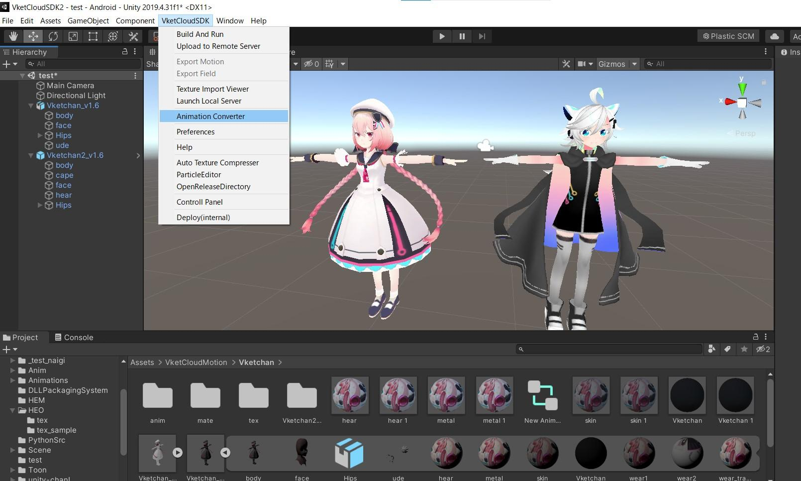

# HEM Animation Converter 使い方
VketCloudで取り扱うアニメーションファイルの形式は、UnityでいうLegacyタイプ(直接ボーンを指定する形式)を使用する必要があります。通常、Unity上でのHumanoidアニメーションからLegacyアニメーションへの変換は、ボーンの名前や構造の違いから、同一のキャラクターモデルでしか行うことはできません。HEM Animation ConverterはキャラクターモデルAのHumanoidアニメーションをキャラクターモデルBのLegacyアニメーションに変換することができます。

## 使用方法
### 1. Animation Converterの選択
Windowツールバーの「VketCloud SDK」タブから、「HEM Animation Converter」を選択する。

### 2. 変数の設定
アニメーション変換前に変数を設定する必要があります。それぞれの変数の意味は下記のとおりです。
・Target Model…VKetCloudでアニメーションを再生するキャラモデルです。このモデルはRigタイプがHumanoidである必要があります。アニメーションを変換したのちに、Unity上で該当モデルのRigタイプをLegacyに変換して、アニメーションが変換されるか確認してください。
・Target Animation…Legacyアニメーションに変換する対象のHumanoidアニメーション
・Root Bone…キャラクターモデルのルートボーン。例えば、Vketちゃん2号の場合、キャラクターオブジェクトの直下には「Reference」があり、これがルートボーンになります。この子に「Hip」「Spine」などが続きます。このように、もしキャラクターモデルの直下に「Hip」ボーンの親となるボーンがある場合、ルートとして設定する必要があります。
・Save Folder…変換したアニメーションを保存するフォルダになります。「Select Save Folder」ボタンを押すと、保存先フォルダを直接指定することができます
・Animation Name…変換後のアニメーションファイルの名前
・Apply SubBone Animation…変換元のアニメーションのサブボーンを変換対象のモデル用に変換します。ただし、モデルAとモデルBはボーン構造が異なるので、通常はそのまま使用することはできません。使用する場合、同じ親子関係、ボーンの名前にする必要があります。
・Export HEM File…変換したLegacyアニメーションをHEM形式に変換します
下記図は、元々Vket2号ちゃん向けに制作されたHumanoidアニメーション(Target)です。そのままLegacy RigタイプのVketちゃん1号(Target Model)に割り当てることはできません。適切なパラメータを設定すると下記図のようになります

### 3. アニメーションの変換
全ての変数を設定し終わった後、Convert Animationボタンを押してください。
変換処理が数秒間行われます。変換処理の終了後、指定のフォルダに変換されたアニメーションが入っています。

### 4. 確認テスト
試しに変換したアニメーションを再生してみましょう。まず、先ほど変換モデルに使用したHumanoid RigタイプのキャラクターモデルのRigタイプをLegacyに変換し、変換したLegacyアニメーションを割り当ててください。
元々は左のVketちゃん2号用のHumanoidアニメーションでしたが、変換後はVketちゃん1号が使えるLegacyアニメーション向けに再変換しました。うまく変換が行われていると、図のように同じポーズが再生されるはずです

### 5. 制約
現在、Animation Converterはβ版です。下記の問題が確認されており、順次解決していく予定です。
その他のコンポーネントのアニメーション（オブジェクトのOnOffなど）を変換できない
変換処理における効率的なイテレーションによる変換速度の高速化
