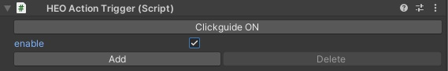

#HEOActionTrigger

HEOActionTrigger is a component for introducing actions to the object.  
It executes the specified actions when a collider is clicked.

To attach a HEOActionTrigger, a Collider must be attached to the object.

You can set any action by clicking Add.  
You can remove the last action by clicking Delete.

For actions, see [Actions Overview](../Actions/ActionsOverview.md).  
For colliders, see [Unity Production Guidelines - Colliders](../WorldMakingGuide/UnityGuidelines.md).

!!! note caution
        In the SDK version 4.8, an defect enabling a `clickable` object to be clickable over another collider is recognized. 
        Avoid this defect by disabling the player to click from an unexpected position by world design, or implement a gimmick to limit the clickable range using the [HEOClickGuide](HEOClickGuide.md).